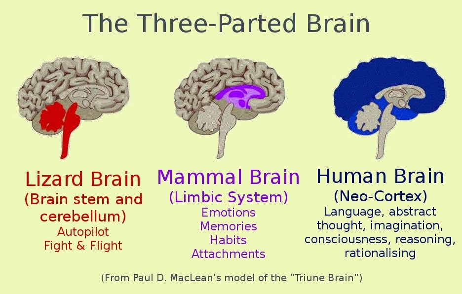

There is so much noise out there these days. Because of concepts like "stories" and an endless stream of flashy, bright entertainment... people are consistently in a reflexive animal like state I call "zombie" mode.

While I don't like this, and I personally steer clear of stories and addictive technology, it's abundantly clear this is the competition when it comes to marketing.

You have to "break" zombie mode in order to get your message across.

<figure>
    
    <figcaption>Major Parts of Brain</figcaption>
</figure>

## The Misconception

The irony is most marketers actually think people have their logical brain on when they are consuming their media. Ha!

What's actually going on is the opposite. People are typically in a hypnotic *click-whir* state (to borrow a phrase from Think Fast and Slow).

So rather than use logic, benefit statements, etc... the first thing you need to do is break the trance: hook your reader.

## Hooks

So what's a hook? Generally a hook is a pattern interrupt. It's something that breaks the trance and gets the reader to pay attention.

They need to play on the lizard brain. The lizard brain is the oldest part of the brain. It's the part that's responsible for survival. It's the part that's responsible for the fight or flight response. It's responsible for sex. It's responsible for food.

The lizard brain is the part of the brain that's responsible for the most basic human needs.

So generally a good hook uses one of these basic needs to get the reader's attention.

## Thirst Traps

On social media, a thirst trap is a photo or video that triggers someone's basic, animal desires: status, sex, competition, survival, etc...

Examples could be attractive people, expensive status symbols, dangerous situations, competition, etc...

Generally a good hook combines some of these elements, along with a bit of mystery. Here are a few examples:

## 1. The "I'm Rich" Hook

<figure>
    
    <figcaption>Fake it til you make</figcaption>
</figure>

This is a hook that shows off your supposed wealth and status. Note, you don't actually need to be rich.

Many influencers just take pictures with super cars or private jets... they don't actually say they own them!

And that's ok... this is just a hook.

Why does it work? Because people have an animal hunger for wealth and status. Especially if they are sick of the 9-5 grind or broke.

## 2. The "Danger" Hook

<figure>
    
    <figcaption>Mr Beast is in Danger!</figcaption>
</figure>

This is a hook that shows off supposed danger. (Note, you don't actually need to be dangerous.)

Mr. Beast uses this often, he'll depict himself almost getting smashed or stabbed. He'll say somethign like "I almost died" or "I almost got stabbed".

Why does this work? Because survival is the strongest instinct.

It's morbid, but people want to see how people die or almost die. Down deep, this is a survival mechanism. Their animal mind thinks they are learning ways in which they can avoid death.

## 3. The "Competition" Hook

This hook discusses a competition or challenge.

Interestingly, this is one of the most powerful hooks. It's also one of the most underutilized.

Competition between people and tribes is as old as humans are. In the old days if your tribe lost, you died. If your tribe won, you lived.

So it's no surprise that people are drawn to competition. Stuff like sports, or even just a competition between two people is  compelling.

To use this in your marketing, you could discuss a competition between two customers. For example, if your product is for weight loss, you could use a weight loss competition between customers, etc..

## 4. The "Sex" Hook

This is the most common and yes, distastefully used hook out there. Which doesn't mean it's bad.

For many products, the result of the result is yes, sex and reproduction.

For example, money leads to status, leads to women, etc..

Because this one is so overused, it can be alluded to or introduced subtly. For example in the "world's most interesting man" ads they simply show the character with interesting people and attractive women. They don't say "buy this beer and you'll get laid".

## 5. The "Anxiety" Hook

<figure>
    
    <figcaption>Trigger Anxiety</figcaption>
</figure>

This is a hook that plays on people's anxiety, it says "you're doing it wrong" or "you're missing out".

Anxiety is an instinct designed to make people pay attention and forecast upcoming danger, problems, or opportunity.

In cave man days, if you were anxious, you were more likely to survive. When someone said "watch out for tigers," the people that heard this and listened were better off.

So same story here.

For this hook to work, you need to use some recent news, trends, fears, etc... to get people to pay attention.

I see it all the time with AI and automation. People are anxious about losing their jobs. So something like "AI is taking over, here's how to survive" is a good hook.

## Conclusion

So there you have it. Hopefully, you can use these hooks to get people to pay attention to your message.

Remember, the first step is to break the trance. Then you can use logic, benefit statements, etc... to get your message across.
