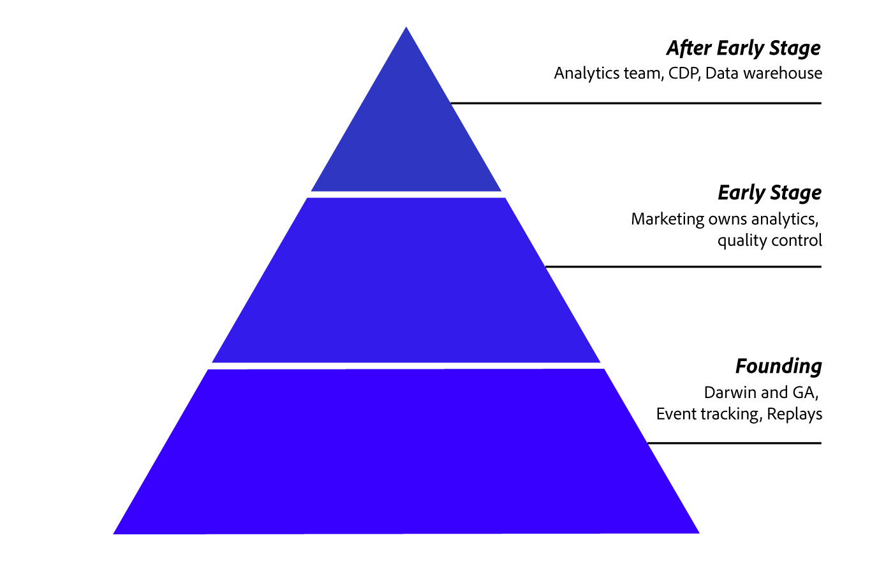

You need to be data-driven.

I say this because today everyone does.

Whatever your competition, you can bet that they have optimized and learned from years of data.

So you need your own "data advantage" because, without it, it's like playing the computer in chess. And If you're like me, the computer always wins.

Analytics is what you'll use to make decisions on every level from top-level strategic ones to line-level tactical ones.

So what investment is needed in analytics and data at my stage of business?

The analytics world is moving quickly. So let's discuss what you'll need to do for every stage of your business.

## Why Listen

In the last decade I've run three startups, and in that time I've seen both the strengths of strong analytics and massive failures that can come from poor oversight.

At my first "successful" company, PageLines, we used data to make decisions that were massively successful and also used it to fuel marketing investment to the tune of $100k per month in ad spend (which earned a good ROI in a competitive space).

I've also seen what happens when data is poorly sourced, or when there are mistakes in the way things are tracked. I've wasted 10s of thousands paying for bot traffic and click fraud.

I've seen poor data management lead to massive technical failure that took months to fix. This led to a huge cost in terms of lost sales.

As a result of these things, I started working on Darwin. A [free analytics suite](https://www.darwin.so) designed to help startup founders succeed.

In this guide, I'm going to do a walk through of what your startup should be doing in analytics. I'll be considering the stage and mentality of the team and trying to keep things simple. Since I know you have a lot to do.

Onward...

## Founding Stage (0 to 7 employees)

**Setting:** you have no resources and no time. Hopefully a few good ideas and minimum viable product.

At first, there are a ton of things you could be measuring. But you're close to the details and things are still small; because of this, you have a good instinctual basis to make decisions.

Here you want to make sure you are measuring what's happening in your product. You'll want to watch [session replays](https://www.darwin.so/features/replay) to visualize the user's mentality through sign-up and critical points in the adoption of your service.

You'll need this qualitative and quantitative information to iterate quickly and get those insights for marketing and sales growth. Everything else can take a back seat.

### Use Old Technology

Maybe the most important insight I can lend to people in this stage of business is this: "use old technology."

Often startup folks get distracted by newer tech that seduces them into thinking that the tech will create a competitive advantage for them. Sadly, let's say 97% of the time this isn't true. What actually happens is the tech doesn't deliver on its promises or has a surprise missing, yet critical feature, that the team "has on the roadmap."

So... for financials just use Quickbooks. For forecasting, deep analysis, project management, seo... just use Excel.

For other things I'm not covering, just **use old technology**.

### Analytics Tips

At this stage of your business, a shotgun style, shoot and ask questions later style will work.

- Install both [Darwin Analytics](https://www.darwin.so) to your app and [Google Analytics](https://analytics.google.com/analytics/web/) on your website via Google Tag Manager.  Google has better integrations and deeper analysis tools, while Darwin adds a lot of features needed for quick insights and [understanding granular behavior](https://www.darwin.so/features/behavior).  At this point, the data won’t be perfect without more work but it’s not the right time to worry about that.
- If you're an eCommerce oriented business, make sure you have eCommerce tracking set up. You'll want to monitor falloff for each point of the checkout and purchase process.
- If you build software, you need to use custom event tracking. This what separates the kids from the adults in the world of startup analytics.  The easiest way to get event tracking is to set up Darwin Analytics and integrate its API. From here, you're just steps away from measuring everything related to your business goals.

### Clean Data is Key

At this early stage of your company, you need to know _everything_ about the traffic you're getting. Presumably, you don't have the budget to waste and false positives/negatives can send you off towards failure.

In addition, you'll need to find ways to tracking things over time and measuring perception.

Early companies have an "incubation" period where they need to build market credibility and strengthen their value prop. Market signals are key in understanding where you're visitors are not getting reinforced or bailing. You can track where customers are falling off (exiting) to understand where they because to have doubts about your readiness to serve them.

## Very Early Stage (7 to 25 employees)

Congrats! You’re growing your team.

As your team becomes more specialized, the key insight you'll need for this stage: "people need data to do their jobs."

### Early Stage Tips

- Everything should have attribution so that you are preparing to do things at scale. Because even if you have a budget, you can't scale things if you aren't absolutely sure they are working.
- If you have a marketing person, make sure they are centered around data. In the old days, marketers got by on good instincts, but today that won't get things done without a strong base in data-driven marketing.  So make sure your marketing team owns and manages your analytics. They should be the ones making sure [the data is real and clean](https://www.darwin.so/features/bots).  If your marketing leader doesn't "get" data, or says "I'm not an analytics person," then I'd highly suggest you reconsider the person you have for that job. Information about doing data-driven marketing is readily available and if they don't see the importance of it, then they're just missing the trend.  So if they can’t figure it out, fire them and get someone else.
- If you have a sales person or two and use a CRM, use the built-in reporting.   At this stage, you may have a couple sales people. Your sales data will still be slim so it probably works to use the default CRM data. But as your sales manager probably tells you, you'll need a structured goals program in place to propel you forward.  You need to be able to know basic things like rep productivity and conversion rates by stage. Just use Salesforce, without too much customization.
- Keep your support metrics simple. Do a simple follow email from customers with a "how did we do?" survey response. This will help you isolate any issues and correct them. Make sure you track NPS using any of a dozen available services.

### After Early Stage?

At this point, I recommend you get a dedicated analytics team. Even if that's just one person.

As I mentioned above, data needs to be core competency and you have the budget so it makes sense to get someone in the role. You'll want to make sure that the analytics team has a technical competency but also a handle on the types of data needed to run business systems like marketing.

Don't go cheap on your analytics team!

## Summary

I’ve come to each one of these recommendations after years of doing it myself within companies and now building an analytics service myself. The opportunity to work with a range of startups has made it clear just how rare it is for companies to do this stuff well.

After years of working with various tools, I've definitely felt a lot of pain from bad data and learned a lot of lessons. This article is meant to cover a few of the things I've figured out and hopefully point you in the right direction.

Remember that in your startup, you need to be data-leader at each stage of growth or you will simply be left behind.
