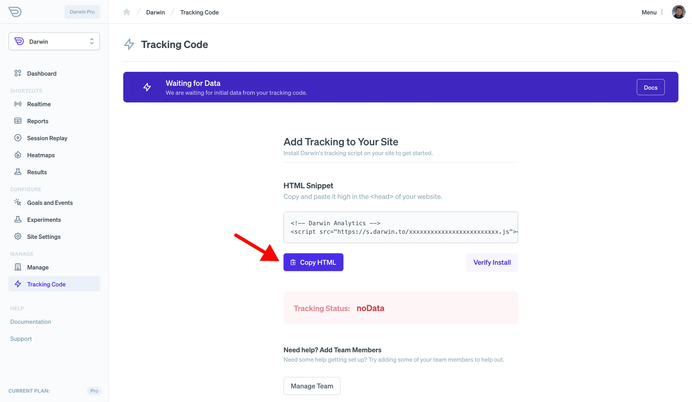

## Before You Start

It can take up to 24 hours for [ClickFunnels](https://www.clickfunnels.com/) to detect the Kaption tracking code
ClickFunnels [Tracking Pixel Guide](https://help.clickfunnels.com/hc/en-us/articles/360006117693) can explain further.

## Get Tracking Code

Login to [Kaption's Dashboard](https://app.kaption.co/login) and visit "Tracking Code" in the navigation.

Copy the tracking code HTML that you'll find there.

## Visit ClickFunnels Dashboard

[Login to ClickFunnels](https://app.clickfunnels.com/) and go to your funnel "Settings".

## Add Custom Code

Add the tracking code in the "Head Tracking Code" field and save settings.

## Verify Installation.

Once you've saved your changes, you can verify your install on the [Kaption dashboard](https://app.kaption.co).

