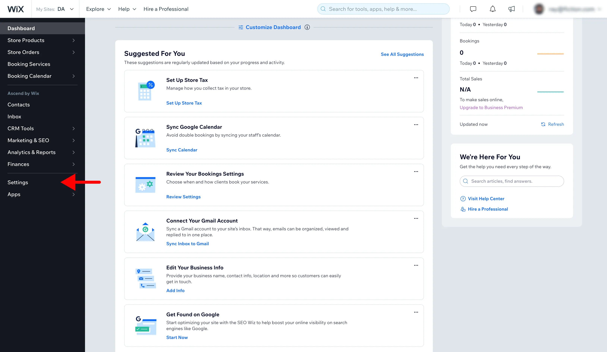

# Install on Wix

### Before You Start

To add the Kaption tracking code to your [Wix](https://www.wix.com/) website you need premium account. This is because Kaption is installed via a Tag Manager or as "custom code" which are enabled once you upgrade. Learn more about this on the [Wix help center](https://support.wix.com/en/article/embedding-custom-code-to-your-site).

### Get Tracking Code

Login to [Kaption's Dashboard](https://app.kaption.co/login) and visit "Tracking Code" in the navigation.

Copy the tracking code HTML that you'll find there.

### Visit Wix Dashboard

[Login to Wix](https://users.wix.com/signin) and go to settings in your Wix site's dashboard.

### Add Custom Code

Click the Custom Code tab in the Advanced section.

Once there, run through the following:

- Click + Add Custom Code at the top right.
- Paste the Kaption Tracking Code in the text box.
- Type in "Kaption Analytics" into script name
- Select "Add Code to: All Pages" and then choose to "Load code on each new page"
- Select "Place Code in: Head" method and save

### Verify Installation.

Once you've saved your changes, you can verify your install on the [Kaption dashboard](https://app.kaption.co).

