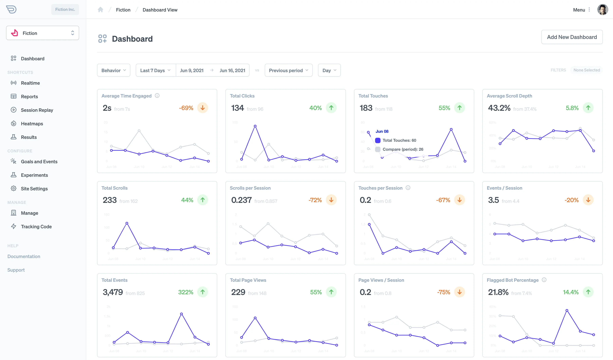

Often analytics metrics can be vague. For example, bounce or engagement rate can be useful but what defines these metrics is hidden behind other abstract numbers. These numbers can often be incorrect which can negatively affect your insights and management.

That's why Darwin measures all typical behavioral interactions that occur on your site. For example, clicks, touches, scrolls. These can help you establish a more direct way of understanding how your design and text affect user behavior

## How Behavioral Tracking Works

Darwin measures every action that a user takes on your site and aggregates it in an analytically friendly manner. Here is a list of what we measure:

- Window load events
- Clicks
- Touches
- Scrolls
- Keypresses
- Engagement Duration
- Mouse movements
- Scroll depth

Knowing the amount of interactions users are having with your site allows for some interesting metrics regarding engagement, usability, bot flagging (bots interact strangely), and more.

## Reviewing Behavioral Analytics Results

Along with behavioral tracking, Darwin gives you several widgets to see how people are using your site.

You can see many of these on the [behavior dashboard](https://app.darwin.so/site/_id_/dash/behavior) in the admin. A few widget examples:

- Time engaged
- Total clicks
- Total touches
- Average scroll depth
- Touches per session
- Total page views
- Views / session
- Total events
- Total scrolls
- Scrolls per session
