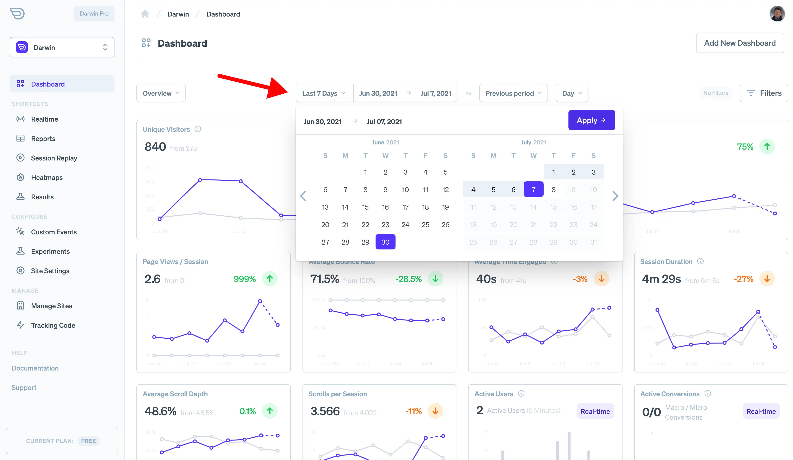

The dashboard is the center of the Darwin app and its data visualization.

With it, you can filter data by date or dimension or you can create custom dashboards based on your business goals.

## Using the Dashboard

When you're logged in, the center of your activity in the Darwin app is its [visualization dashboard](https://app.darwin.so/site/_id_). Once you've successfully created a site and started tracking your users, you should begin to see information here in various charts and aggregations.

To switch between various dashboards, there is a dashboard selector as well as a list of shortcuts for popular dashboards in the sidebar. By default, Darwin includes the following dashboards:

- [Traffic Overview](https://app.darwin.so/site/_id_) - Various widgets that provide an overview of traffic and events.
- [Realtime](https://app.darwin.so/site/_id_/dash/realtime) - Which provides live updating information about visitors within the last 30 minutes.
- [Session Replay](https://app.darwin.so/site/_id_/dash/replay) - A listing of session replays that have been recorded along with charts for the amount of time recorded and frequency of recording
- [Heatmaps](https://app.darwin.so/site/_id_/dash/heatmaps) - A live heatmap that uses click/touch/scroll data based on filters you provide
- [Reports](https://app.darwin.so/site/_id_/dash/reports) - Table based reporting and filtering across a variety of dimensions. Useful for isolating trends and outliers.
- [Experiment Results](https://app.darwin.so/site/_id_/dash/results) - Visualization and comparative results from AB testing experiments.
- [Conversion Charts](https://app.darwin.so/site/_id_/dash/conversions) - Charts and data relating to your custom goals and conversion events.
- [Behavior](https://app.darwin.so/site/_id_/dash/behavior) - Information about the interactions that are happening in your app or site. For example: clicks, scrolls, keypresses, touches, etc.
- [Performance](https://app.darwin.so/site/_id_/dash/performance) - How well is your website loading for your visitors. Tracks Google's recommended page vitals and network data.
- [Security](https://app.darwin.so/site/_id_/dash/security) - Darwin also attempts to flag and identify suspicious traffic and bots that are pretending to be real visitors on your site. This can be helpful in identifying who is sending bad traffic and the quality of referrers.

## Filtering Data

Once you're familiar with the standard dashboards and capabilities of Darwin's dashboard; it's time to learn about filtering your data. Filtering is a crucial part of the data workflow and important in fully understanding your users. With Darwin, you can filter based data and time parameters as well as by dimension; which is another way of saying filtering the data by a characteristic of the data.

### Filtering By Date

To filter by date, Darwin provides a simple set of date toggles and inputs.

- **Selecting Dates**   To filter by specific dates, you can use the calendar drop down which triggers when clicking on the dates in the top bar. You can also select from a predefined set of date ranges such as the last week, last 3 days, yesterday, today, etc.
- **Comparing Between Periods**   You can also compare your current date range of data, with a prior date range using the compare period selector. This will shift the compare period by a selected amount. The default "period" compare, will simply match the current date range with an equivalent date range before it.
- **Data Interval**   Select the data interval used to plot your data. This essentially tells Darwin how to group or slice your data by month, day, hour, etc.

> Tip: You can speed up your date range selection by entering your dates directly into the URL as a query parameter `?from=2021-07-04&to=2021-07-07`

### Filtering by Dimension

Often you'll want to narrow down your analytics data by a specific attribute. For example, you may want to see how traffic from a specific referrer performs and converts; or you may want to see specific data based on region, device, browser, etc. For that, we have dimension filtering.

Darwin provides several ways to filter your data.

- **Quick Filters**: To quickly filter based on data from an aggregation, you can simply click on the line in the aggregation. For example, clicking on a specific browser will filter to only sessions with that browser.
- **Advanced/Custom Filters:** To apply more advanced filters, you can use the filters panel. You can find the link to this in the upper right side of the dashboard. Here you can filter based on user behavior, user technology (like device, browser, os), referral parameters, geography and events that were triggered during sessions.

## Custom Dashboards

If you want to make custom dashboards to match the goals and needs of your business; Darwin makes this super easy.

To create a new custom dashboard, just follow these steps:

- Click "Add new dashboard" button on the top right of any dashboard page
- Name the new dashboard
- Click "Add Widget" to show the widget panel
- Select various widgets for your dashboard
- All done? All you need to do is hit save.
