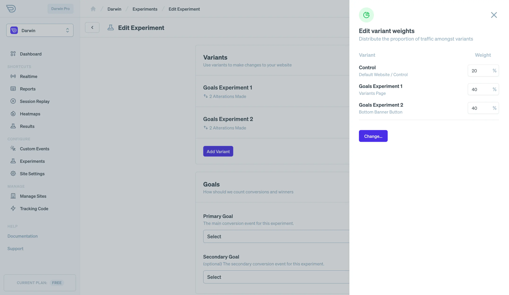
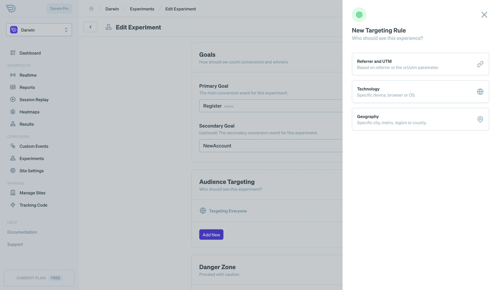

It can be super difficult to understand which headlines and UI turn the maximum number of your visitors into customers. And AB testing can be very difficult to implement in an actionable way.

That's why we've introduced AB analytics a light-weight yet powerful AB testing tool that is easier to use and get insights from.

## Before You Start

To use experiments most effectively, you'll want to make sure the tracking script is installed and running in the head of your site. This allows for earlier loading in the page lifecycle which allows us to substitute text and make changes before they load for the end user.

- **Editable components:** Note that the visual editor only allows for editing of text based HTML selectors rather than general ones like `div`. Make sure any text or elements you'd like to modify are wrapped in an element like a `span`, `p`, `h1`, tag.
- **CSS Classes** The variant editor will use selectors to identify elements when substituting. You may also want to add specific classes or ids to HTML elements to allow for best performance and minimal testing issues. Don't rely on selectors from libraries like TailwindCSS (e.g. `.text-lg`) as they may be too generalized for a robust selector.

## Configuring Your Experiment

The first step to implementing a new experiment is to create one on the [experiments configuration page](https://app.darwin.so/site/_id_/experiment) in Darwin's app. All that is needed is to name the experiment. Note that this name will be used and referenced in your analytics data.

Once you've started a new experiment, you're taken to the experiment configuration page. Here you can do basic setup like adding an experiment description (so others know why the experiment exists), but also here you create variants, select goals and target users.

Let's dig in.

### Creating Variants

When creating experiments, the most important component is the variants. These are the modifications of your pages that are tested and monitored which may or may not create changes in user behavior.

To create a new variant, click `add variant` and you'll be taken to the variant editor. Here you should see an iframe based browser used to give you a way to visually edit your site.

- **Load a Page:** The first step in editing your variant is to load a page of your site in the frame based browser. You can start by clicking `render homepage` or by typing a path into the browser bar.
- **Edit Text** Now that you've loaded a page, you should be able to hover over any text oriented element on your page and see an edit box pop up. To edit text, just click. From here, you should be able to add your change by clicking the button on the edit box.
- **Modify/Review Your Changes** Now that you've made your changes, you should see them in the sidebar at right. Here you can click on it and make modifications to the text, selector, etc from your changes.
- **Navigate and Edit** Continue to navigate through your site and make changes as needed for this experiment. Note you can press the `option key` to enable click based navigation of your website.

### Variant Weights

Once you've created your variants, you need to assign them weights in the experiment. Weights determine the percentage of eligible traffic (see targeting) that is shown a specific variant or the control (default case).

To set your variant weights, click the `XX% weight` button next to any created variant. A panel should pop up which will allow you to make a modification. Once you close the panel, make sure to save your changes via the `save changes` button or the changes won't be retained.

### Selecting Goals

Now that you've created variants, it's time to set the goals you'd like to test against to determine the "winner" of this experiment. If you haven't already, you may need to create specific goal events on the [custom events](https://app.darwin.so/site/_id_/custom-events) page in the dashboard.

The goals you select are what determine the meaning of a conversion as it relates to your experiment. So set your goal carefully.

### Targeting Specific Users

It may be desireable to only run this experiment against a subset of your users. This can help reduce the amount of noise involved from irrelevant visitors and also to prevent false positives and negatives as they relate to your target markets.

Similar to setting filters, you can set "rules" for experiments. To do so, just click `add rule` and you'll see a panel allowing you to set rules targeting referrer, technology or geography.

### Publishing To Your Site

Once you've configured your basic experiment settings, variants, goals and rules; it's time to publish your experiment live. Once you do this, note that your variant experiments will be actively served on your website.

## Experiment Results

Now that your experiment is live, we are actively tracking data that will allow us to compare results across your variants.

To view the experiment results go to the [results dashboard](https://app.darwin.so/site/_id_/dash/results) and select the experiment whose results you'd like to review.

Here you'll see the following:

- **Conversion Rate Charts (Primary and Secondary Goal)** You can review the conversion rate over time for your AB tests. Having an active chart allows you to continually modify your variants, as long as you note that those changes may affect the experiment result calculations (so you'll need to adjust your dates accordingly)
- **Goal Performance (Primary and Secondary Goal)** AB testing tools make use of statistical methods to calculate winners in comparative tests. In the performance table, we list the conversions for each variant along with the total sessions for each. Then we apply statistical models to give you the significance (e.g. can this result be trusted) and the confidence interval (what range is the true conversion rate of a variant)
