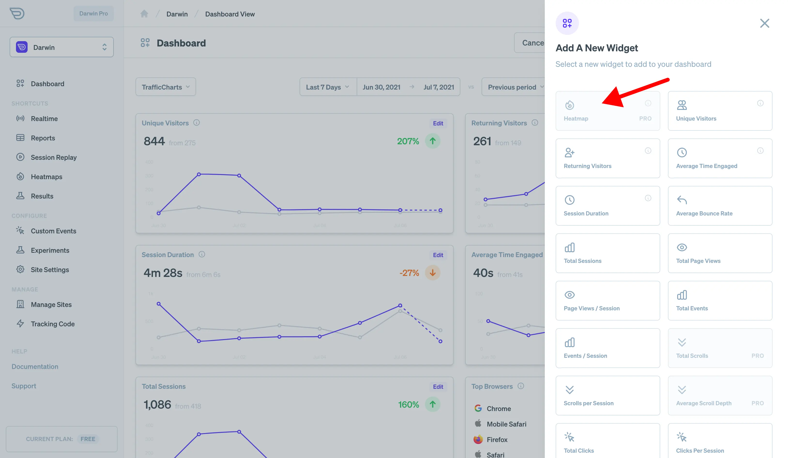

With live heatmaps you can see a realtime, live visualization of clicks and interactions as they happen on your site. Heatmaps are a great way to qualitatively review how people are interacting with your pages.

## Before You Start

To use heatmaps, you'll need to make sure you have tracking installed and actively taking data.

## Viewing Your Heatmaps

If you're already collecting traffic data, you should be able to see your heatmap by visiting the [heatmaps dashboard](https://app.darwin.so/site/_id_/dash/heatmaps).

Here you will see an iFrame based browser that loads your site along with a heatmap UI.

## Filtering Based on Device or Attribute

To query the interaction data for the heatmap, e.g. clicks, Darwin uses the standard data and attribute filters available throughout all your dashboards.

- **Different Devices:** You probably want to see your heatmap as it applies across devices. So on the heatmaps dashboard, there is a special device type selector. When you set this, the heatmap should adapt to match.
- **Clicks based on Attribute** Heatmaps use standard filters, so you should be able to set them using the filters panel. Or, if you've set a filter in another dashboard panel that filter should carry over to the heatmaps panel when you navigate to it.

## Adding to Custom Dashboards

You can add your heatmaps to custom dashboards. When adding widgets you should see one available for heatmaps.

