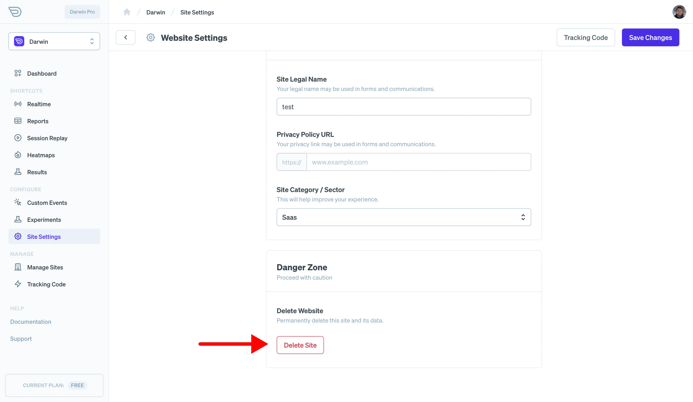

When getting started with Darwin, you'll want to familiarize yourself with the configuration options you can set for your site. In this guide, we'll go over each available option and what it does for you.

## Before You Start

After you've created a site on Darwin, you'll be able to [see your site settings](https://app.darwin.so/site/_id_/settings) by visiting the tab on the dashboard. Familiarize yourself with the various options and we'll go over what they do below.

## Site Information

The first section available in site settings is the basic information section. Here you can change the name and primary domain for your site or app. Note that if you'd like to adjust the team or deal with billing issues, those settings are handled at the organization level which you can [access here](https://app.darwin.so/manage/org).

## Tracking Settings

### Tracking Mode

Darwin currently offers two tracking modes:

- **Standard Tracking** - This is the default tracking mode for Darwin which makes use of persistent identifiers to enable features like AB testing, new vs returning users, etc. While we highly recommend you use this tracking configuration, it may require a cookie consent banner in certain regions which is triggered by the storage of a persistent ID.
- **Basic Tracking** - Basic tracking disables any browser stored information after the user's session is over. The advantage here is that there are fewer legal privacy considerations as no personal identifiers are created or stored. While this is still a robust approach some features may not work as accurately.

### Domain Validation

You may want to only accept traffic from specific referring domains. To make sure that traffic and events are accepted from only your primary domain, select this option.

### Block IP Addresses

Often people don't want to track themselves or their colleagues in their analytics. This option provides a convenient way to make sure no events are accepted from listed IP addresses.

## Session Replay Tracking

To enable session recording and replay, you'll need to configuration options in this section. To get started, first enable session recording by toggling the enable session recording switch.

### Targeting Session Recordings with Events

As only a limited number of sessions of recordings are saved per day, you should target the sessions you find interesting by triggering session replays only on the events you care about. In this section, you can select any of your [custom goals or events](./goals-events) as triggers or use some of the more general standard settings. For example, you can record on any micro or macro conversion.

### Privacy and Legal

In this section, there are just a few settings to provide links to your privacy policies and legal details. This can help us ensure compliance based on your home region and keep you aware of any legal changes.

### Delete Site

If you need to delete a site, for any reason, you can do it at the bottom of the site settings page. Be careful as this will delete your site and all of its data from Darwin's servers.

