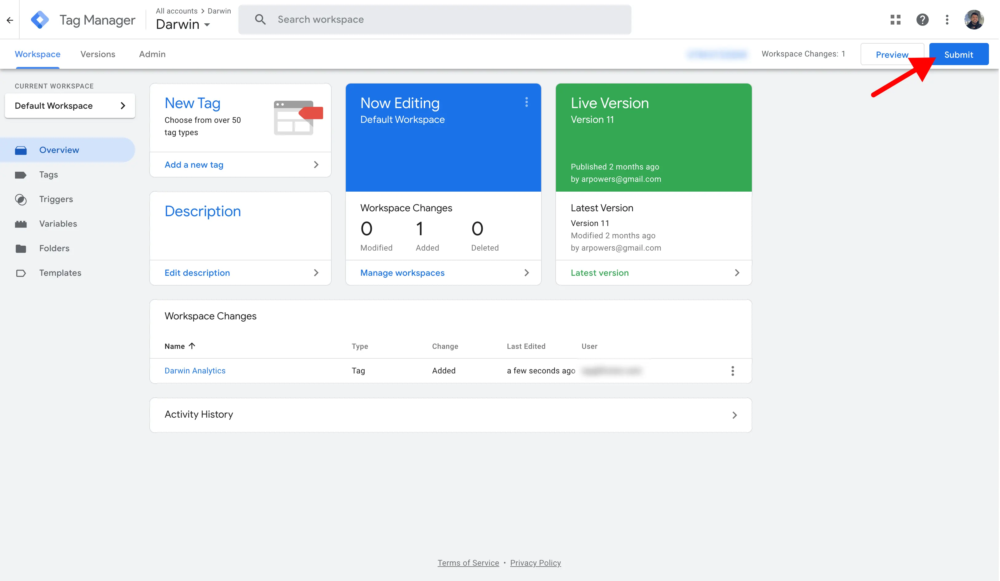

# Install on Google Tag Manager

### Before You Start

You must install [Google Tag Manager](https://tagmanager.google.com/) on your website before following the rest of this guide. If you haven't, you can learn how in their [setup and install tag manager article](https://support.google.com/tagmanager/answer/6103696).

### Get Tracking Code

Login to [Darwin's Dashboard](https://app.darwin.so/login) and visit "Tracking Code" in the navigation.

Copy the tracking code HTML that you'll find there.

### Visit Google Tag Manager Dashboard

Login to [Google Tag Manager](https://tagmanager.google.com/) and click on "Add a New Tag" button.

### Add Custom HTML

Click the "Tag Configuration" section

Select "Custom HTML" in the tag type list.

Add the tracking code into the text field.

### Choose a Trigger

Click "Triggering" section.

Select "All Pages" as trigger.

### Publish Tag

Name the tag and click "Save".

Submit changes.

Make sure your live environment is selected, and click "Publish".

### Verify Installation.

Once you've saved your changes, you can verify your install on the [Darwin dashboard](https://app.darwin.so).

