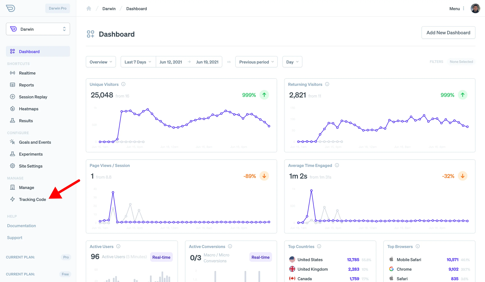
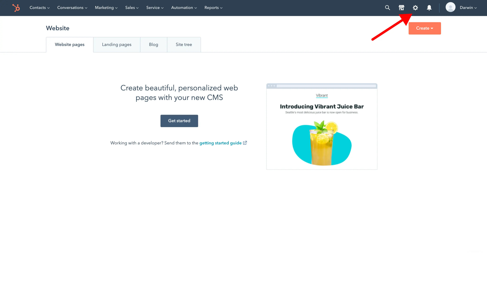
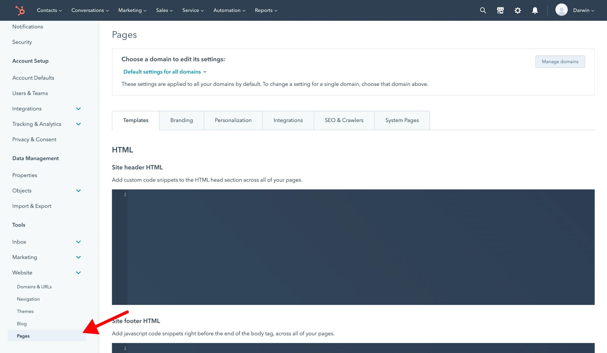

# Install on HubSpot CMS

### Before You Start

Installing Darwin tracking code in [Hubspot CMS](https://www.hubspot.com/) should be easy. But if you have any problems, here is their guide to [adding snippets to the head of your pages](https://knowledge.hubspot.com/cos-general/how-can-i-add-code-snippets-to-the-head-and-footer-html-of-my-pages).

### Get Tracking Code

Login to [Darwin's Dashboard](https://app.darwin.so/login) and visit "Tracking Code" in the navigation.

Copy the tracking code HTML that you'll find there.

### Visit Hubspot Dashboard

[Login to Hubspot](https://app.hubspot.com/) and click on the settings icon in the main navigation bar.

### Add Custom Code

Go to "Website > Pages" on the sidebar menu.

Select the Domain you want to track.

Add the tracking code in the "Site Header HTML" text field and save.

### Verify Installation.

Once you've saved your changes, you can verify your install on the [Darwin dashboard](https://app.darwin.so).

