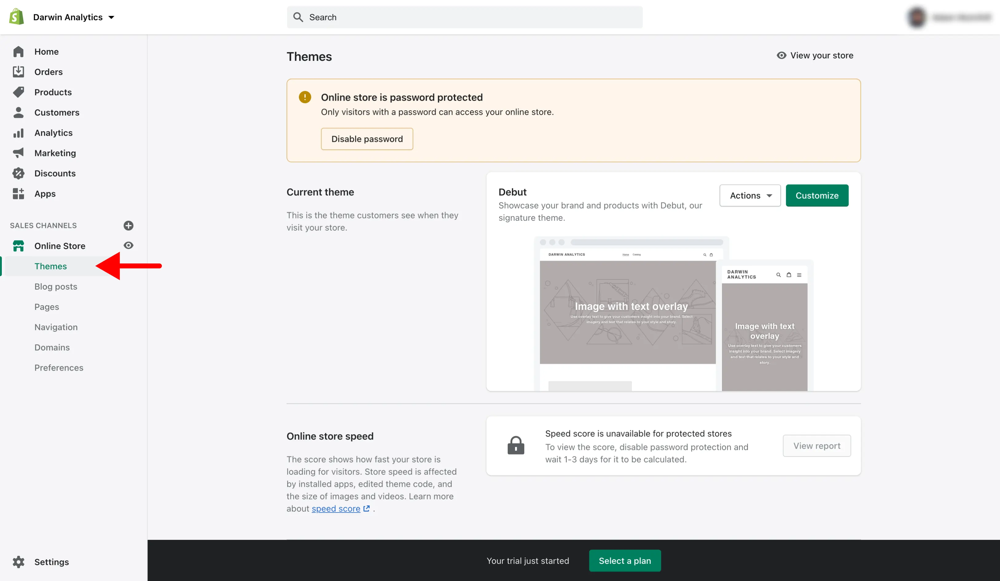
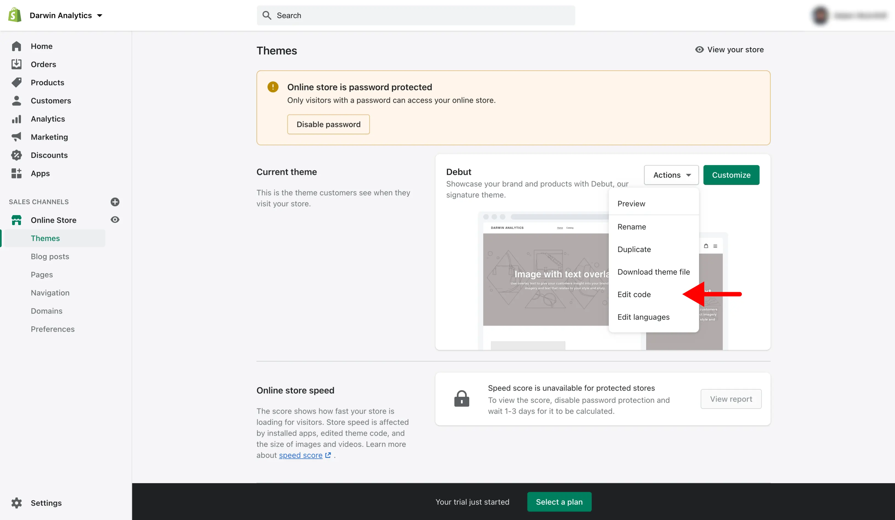
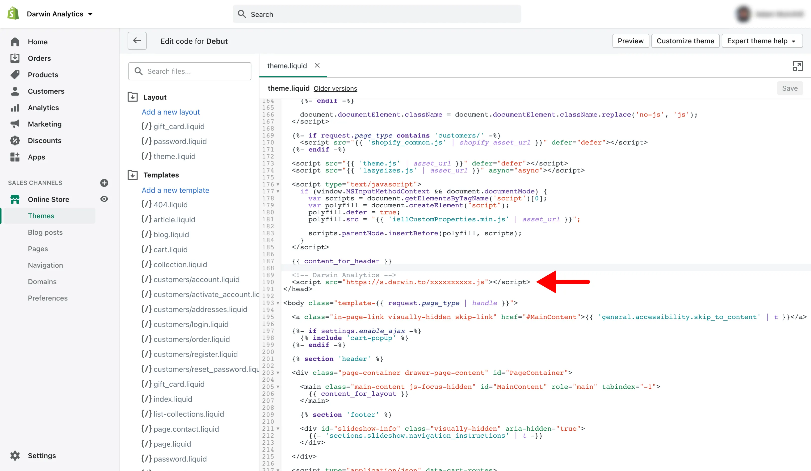
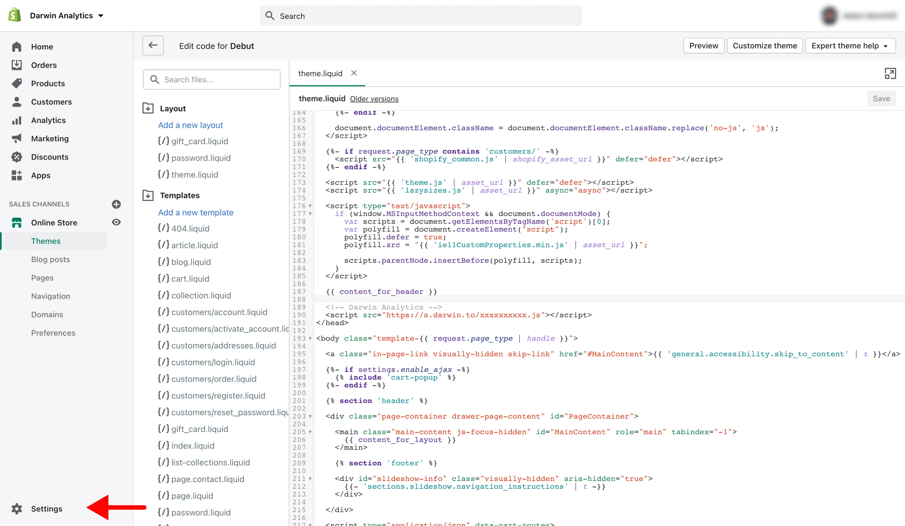
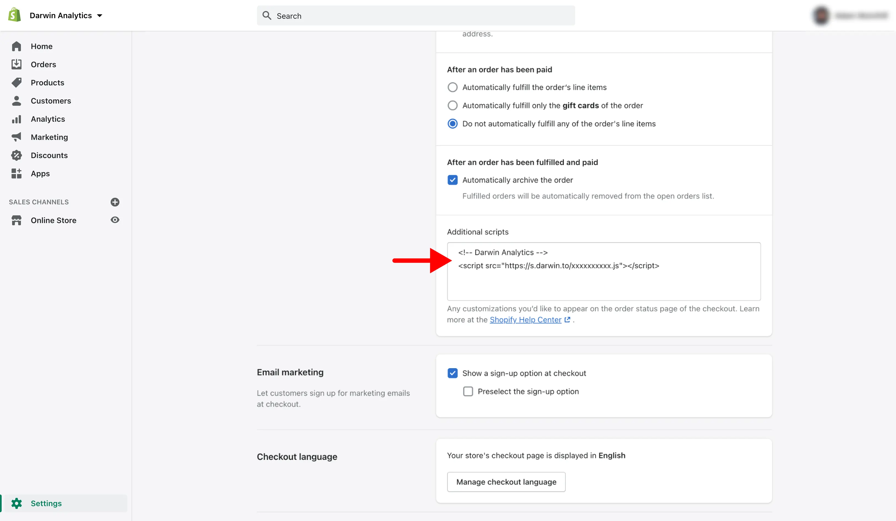

# Install on Shopify

### Before You Start

The Darwin tracking code can be installed on your [Shopify](https://www.shopify.com/) theme but you can only track your Storefront and the "Order Confirmation" page because Shopify's default checkout pages block third-party scripts.

### Get Tracking Code

Login to [Darwin's Dashboard](https://app.darwin.so/login) and visit "Tracking Code" in the navigation.

Copy the tracking code HTML that you'll find there.

### Visit Shopify Dashboard

[Login to Shopify](https://accounts.shopify.com/) and go to "Online Store > Themes" on the navigation.

### Add Custom Code

Click on the "Actions" dropdown of your theme and select "Edit Code".

Under the "Layout" section, select "theme.liquid" file.

Scroll down the page until you find the following tag: **`</head>`**.

Some themes will use `{/head}`, `[/header]`, or other variations of `[/head]`. These will work the same way.

Add the tracking code in this file before `</head>` closing tag and save changes.

Click "Save and Publish" your theme to apply the changes.

The Darwin tracking code should now be installed on your Storefront.

### Track Order Confirmations

If you want to track order confirmations, you will need to install the tracking code in another section.

Click "Settings" on the navigation.

Click on "Checkout" link.

Scroll down until you reach the "Additional Scripts" field and add tracking code.

### Verify Installation.

Once you've saved your changes, you can verify your install on the [Darwin dashboard](https://app.darwin.so).

