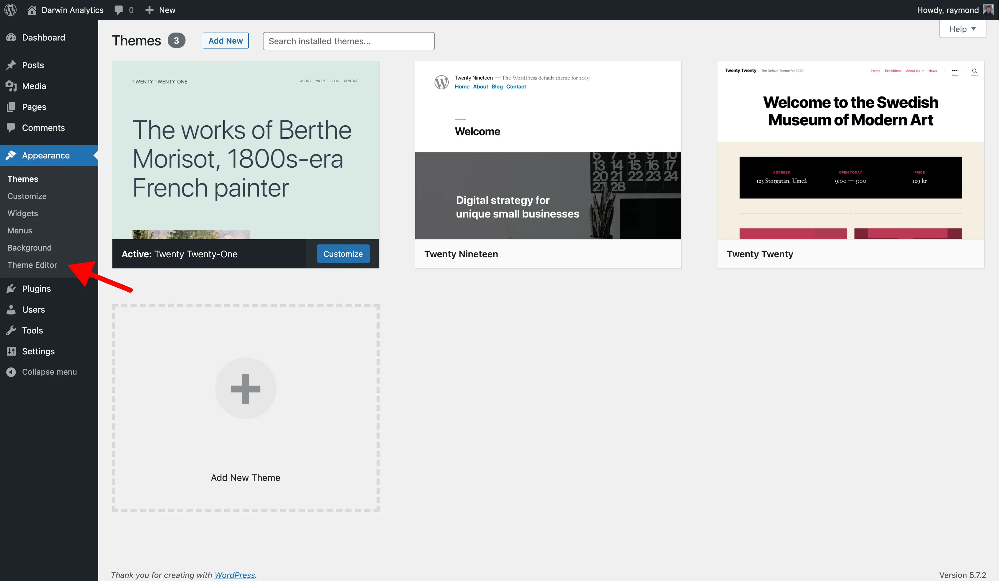
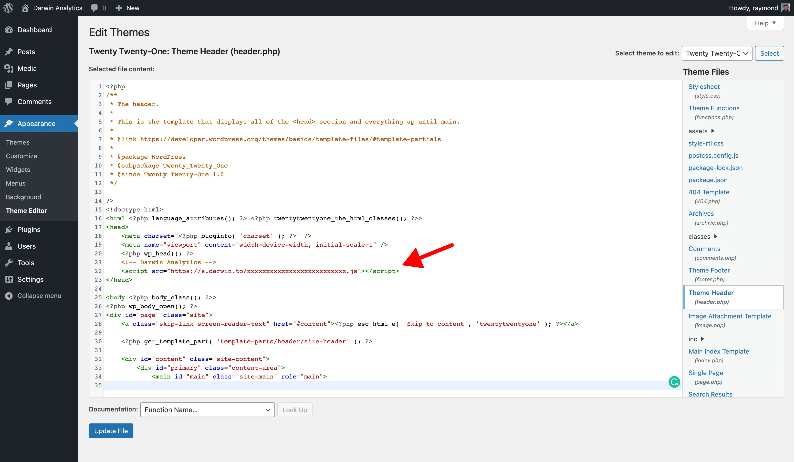

# Install on WordPress

### Before You Start

The Darwin tracking code can be installed on [Wordpress.com](https://wordpress.com/) Business plan and self-hosted versions of Wordpress from ([Wordpress.org](https://wordpress.org/)).

Darwin isn't available for users on a [Wordpress.com](https://wordpress.com/) free or personal plan since you cannot add Custom HTML or install plugins on these plans.

### Get Tracking Code

Login to [Darwin's Dashboard](https://app.darwin.so/login) and visit "Tracking Code" in the navigation.

Copy the tracking code HTML that you'll find there.

### Visit WordPress Dashboard

Login to WordPress dashboard and go to "Appearance > Editor" in the navigation.

### Add Custom Code

Find your "Theme Header" (header.php) file and open it.

Add the tracking code in this file before `</head>` closing tag and save changes.

**Things that you should be aware of:**

- You’ve added tracking code to your theme. If you change your theme, you will have to add the tracking code again.
- You may need to clear cache to see changes in your theme.

### Verify Installation.

Once you've saved your changes, you can verify your install on the [Darwin dashboard](https://app.darwin.so).

