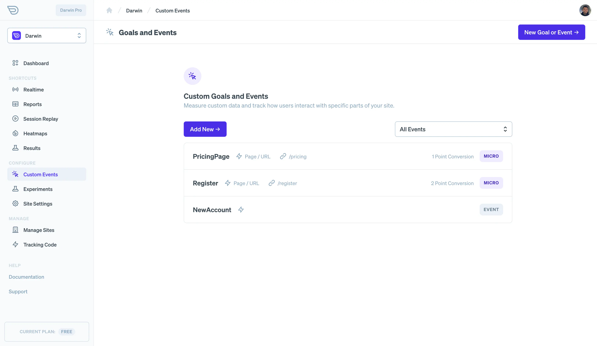
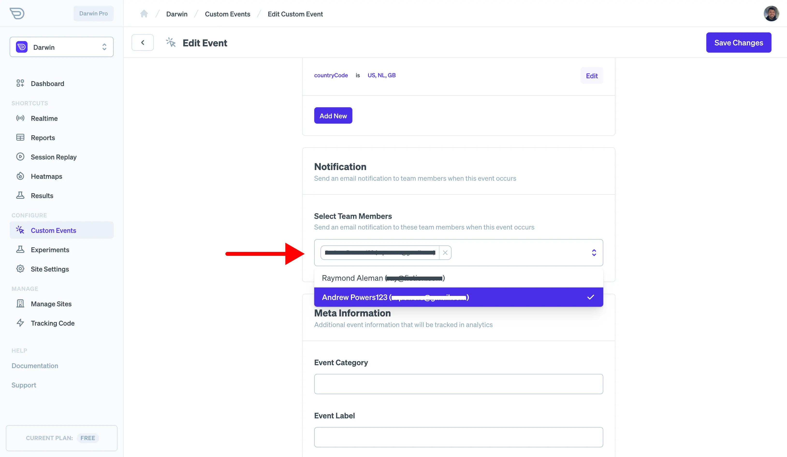

Creating events and goals is a crucial part of getting value from Darwin. Events and goals allow you to create funnels, measure conversions, see which results are better in experiments, etc..

Many metrics are based on events so in this guide we'll go through the basic step in creating and using them.

## Creating New Goals and Events

Once you've [created a site](https://app.darwin.so/manage/org?mode=newSite) on Darwin, [create an event or goal](https://app.darwin.so/site/_id_/custom-events) using the dedicated tab in the dashboard.

On this page, you'll see a listing of any existing events you've created along with buttons for creating a new goal or event. Click on one of these and create a name for your new event. Note that the event name can't be changed later as it is used as the reference in analytics data and changing it is equivalent to creating a new event.

Once you've started and named your new goal or event, it's time to configure it. There are three types of events: macro and micro goal events and regular events for tracking.

## Macro and Micro Conversions

In digital marketing parlance, a conversion is any visitor action that could be considered "desireable." However, you might have noticed that there is definitely a difference in the value between different types of conversions. For example, a closed sale is worth actual money while a user browsing your pricing page is just a step on the path to making that sale. This is the reason for the distinction between macro and micro conversions.

- Macro Conversion: A conversion event that can be assigned a value. E.g. $5/conversion. Examples include completed sales, or leads generated.
- Micro Conversion: A desireable action that leads to a future macro conversion. These are steps in the funnel or can be assigned a weight based on their significance to your business. Examples of good micro conversions are newsletters sign ups, watching product videos, etc.

## Creating Goals

Now that we know what macro and micro conversions are, we can create them using the dashboard. Again, you'll want to start and name a new event first which will then take you to the event/goal editor.

To create a goal, just select "macro" or "micro" for the event type. This will enable conversion specific options below.

### Macro and Micro Goal Settings

The key difference between these two is that you should be able to estimate a value to associate with a macro conversion. Don't worry about being overly specific, for most use cases an estimation of value is fine. If you need specific revenue calculations, we discuss dynamically assigning the value in the developer documentation.

With micro conversions, you may consider an account sign up much more "valuable" to end conversion than when someone views your pricing page. So thats why you can assign a weight from 1 to 3 to them. A weight helps us create better charts and visualization tools to establish if and when you are doing better with your micro conversion performance.

> **Set Value with the URL:** If a URL query parameter is set for value, e.g. `?value=10` then this value will be used and added to the value parameter of any conversion event.

## Creating Regular Events

If you'd like to create a general event for tracking, but you don't want to associate it with a "conversion" then create a regular event. Regular events are useful for general tracking of user behavior.

## Event Triggers

Once you've set the basics for your events, the next step is to set their trigger. The event trigger is something that happens on your website based on a URL, element on the page, user behavior, etc..

We'll discuss the standard triggers provided by the API below, but note that events can always be triggered using Darwin's API with `trackEvent`.

- **Page / URL Trigger**  This trigger allows you to create your event when a specific URL is visited on your site. It supports query parameters as well (e.g. `?signedUp=true`)
- **Element Click**  This trigger will fire when an element with a [specific selector](https://developer.mozilla.org/en-US/docs/Web/API/Document_object_model/Locating_DOM_elements_using_selectors) is clicked by a user.
- **Element View**  This trigger will fire when an element with a specific selector appears on the page.
- **Engagement Metric**  This trigger will fire when an engagement metric hits a specified value. For example, when a user has been active on your site for a specified time, or has interacted with your site a specified amount.
- **JavaScript API**   The JavaScript API is a more versatile way of working with Darwin goals and events as you can easily add additional data and modify attributes like `value`. You can also fire events/goals multiple times if desired. The tradeoff is that you'll need to add JavaScript code to fire the events. This is discussed in detail in the developer documentation.

### Fire-Once

By default, all standard event triggers are set to fire only once per visitor/device. This is because you likely don't want to track conversion events multiple times for the same users.

## Notifications

You can notify team members in your organization when an event occurs. When creating the event, there is a notifications section. Click the selector and you should see the members of the team associated with your active organization.

By default, Darwin will use the team members default notification channel to notify them. For example, email address or SMS message.

## Meta Information

Darwin supports standard methods for adding meta information to analytics events. Namely, a label, action and category. In events dashboards, you may see these values in aggregations or charts. For example, "top event labels" or "top event categories."

Use these however you see fit; however [here are some general guidelines](https://stackoverflow.com/questions/32318836/google-analytics-how-to-understand-category-action-and-label-for-a-mobile-proje) in creating them.
