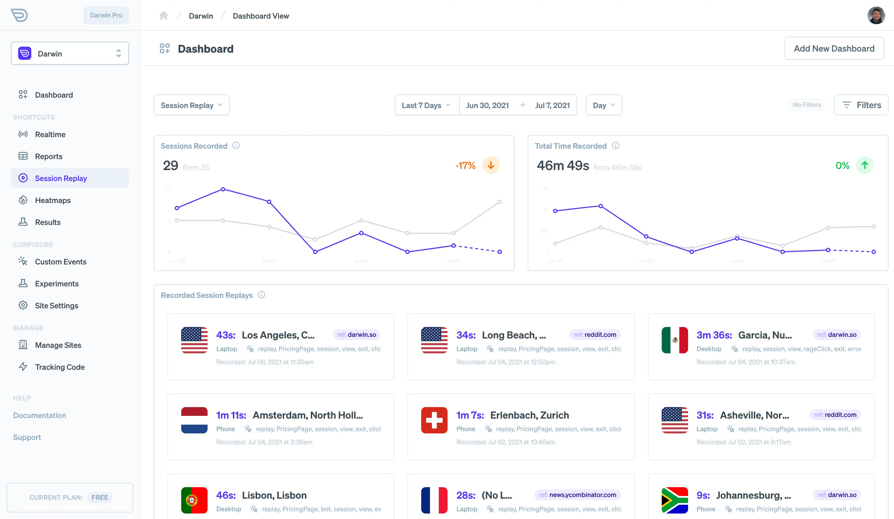

Session replay is an indispensable tool in your analytics and monitoring. This innovative technique allows you to review the actual experience people have as they use your app or browse your site.

In this guide, let's go over how Darwin makes use of this technology and how you can use it to improve your digital experience.

## Before You Start

Session replays are triggered based on specific events that occur on your site. Before you will be able to review them, you'll need to make sure they have been activated on site settings. Also, you'll need to make sure you are targeting the sessions/visits you care about using custom events or other settings.

## How Session Replay Works

Session replay works by storing the HTML information of your website as well as the changes that occur as someone use your site. These changes include modifications to your HTML but also event like mouse movement, clicks, keyboard events and more.

When this information is stored, we can simply "replay" it for you to recreate the visit of the user.

> A note on privacy: Darwin blocks specific information from input fields and frame elements to prevent secure information from being stored on Darwin servers. This protect your visitors from any issues regarding privacy.

## Targeting Specific Visits

As noted above, you likely will want to target visits based on special things that happen. For example, a visit that experienced an error or a visit that went to a specific page but didn't convert.

You can do this under site settings / session replay.

## Reviewing Sessions

Session replays are available under the [replay dashboard](https://app.darwin.so/site/_id_/dash/replay) in the admin. Here you should see sessions you've recorded.

If you'd like to narrow things down, this dashboard will respond to any date and attribute filters you've set. For example, you can narrow down to a specific device or os with filters.
