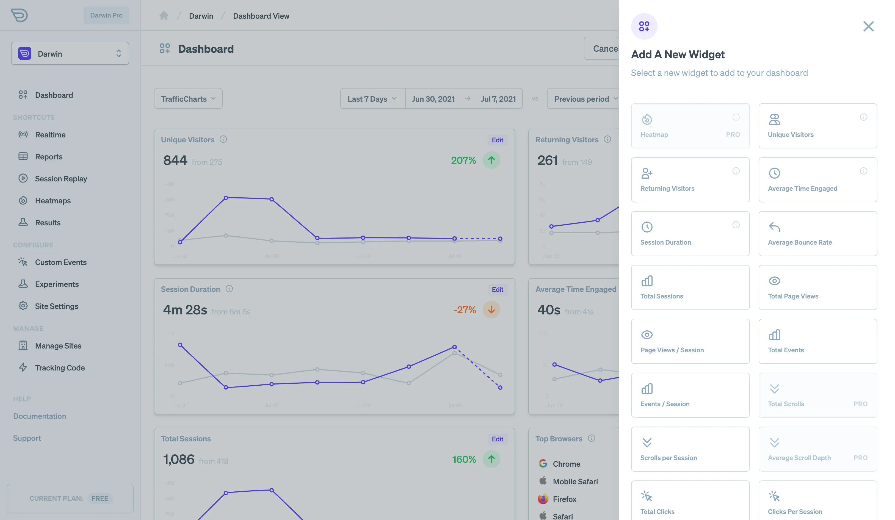

Darwin does everything possible to give you world-class traffic analytics, reporting, and aggregation experience that will help you grow you traffic and business.

## Before You Start

Make sure you've successfully installed the tracking script on your site or app. You may also want to review available tracking settings to ensure you are capturing data in the best way possible.

## Traffic Data

Darwin captures user data by firing events on critical moments in their visit to your site or app. For example, we capture the following loading and navigation events for every visit:

- **Init:** When the user connects to Darwin's server
- **View:** A window `load` event is fired or the URL has changed (`history navigation`). The user has loaded a page or navigated to a new one (without loading as in single-page-applications)
- **Exit** The user has exited which means they've gone idle or "unloaded" a page.
- **Vitals** Page loading vitals and loading performance became available

Whenever these events are triggered we also gather relevant information about the visitors browser, device, URL etc. With this data, we can create traffic analytics which is used to plot the volume of visits and exact ways they used your site.

## Traffic Charts and Aggregations

Given the traffic data we've tracked, Darwin gives you several standard widgets to visualize your web traffic. Here are a few:

- Unique Visitors: The unique visitors that visited your site charted over time.
- Returning Visitors: Visitors detected as returning over time.
- Session Duration: The average duration of a session. In effect, the duration from the first event to the last event of the session.
- Engaged Duration: The average amount of time a user was actively using your site or app
- Total Sessions: The total number of browsing sessions created by visitors
- Top Browsers, Countries, Devices, etc: Aggregations listing your data aggregated or "grouped by" a dimension such as browser
- Top Events: Top events (or event labels, actions, categories) fired by your visitors

That's just a sample of the various widgets. Currently there are over 40 that make use of standard traffic data.
