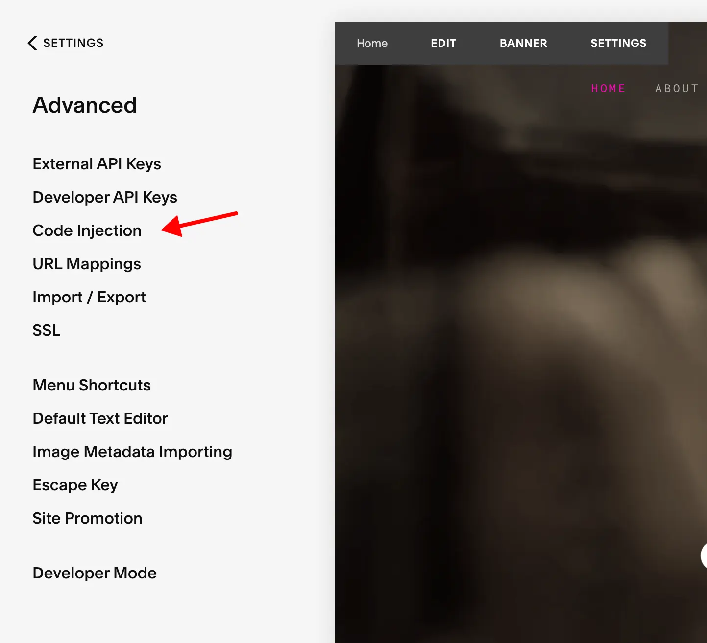
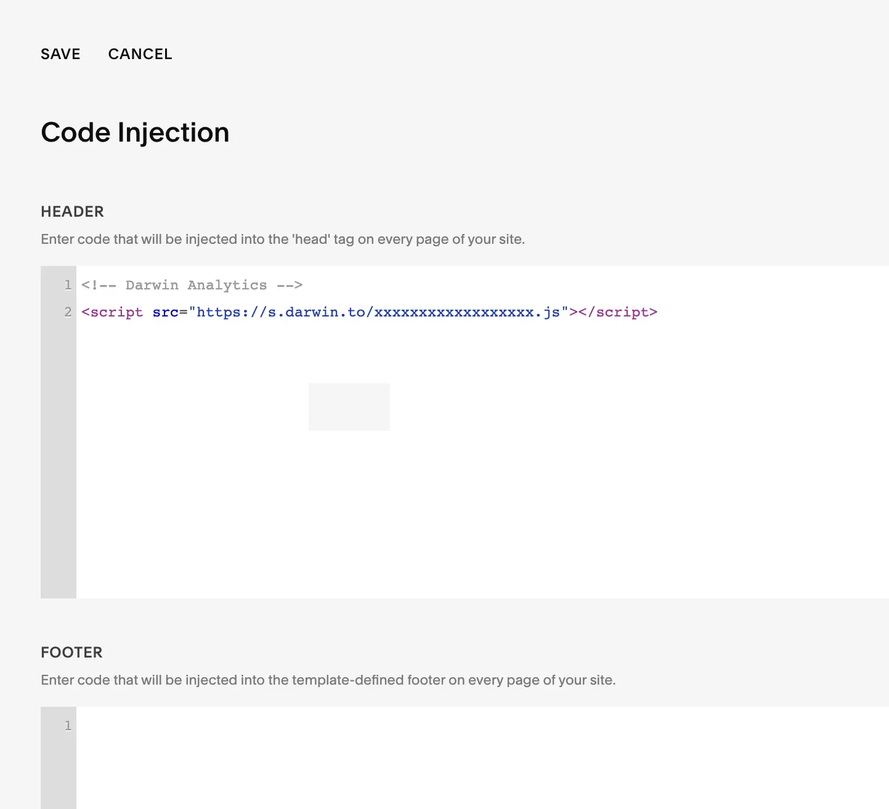

# Install on Squarespace

### Before You Start

To add the Darwin tracking code to your [Squarespace](https://squarespace.com/) website you need premium plan.
This is because adding custom Javascript is only enabled once you upgrade.

### Get Tracking Code

Login to [Darwin's Dashboard](https://app.darwin.so/login) and visit "Tracking Code" in the navigation.

Copy the tracking code HTML that you'll find there.

### Visit Squarespace Dashboard

[Login to Squarespace](https://login.squarespace.com/) and go to settings in your Squarespace site's dashboard.

### Add Custom Code

Navigate to "Advanced > Code Injection".

Add the tracking code into the "Header" text field and save changes.

### Verify Installation.

Once you've saved your changes, you can verify your install on the [Darwin dashboard](https://app.darwin.so).

