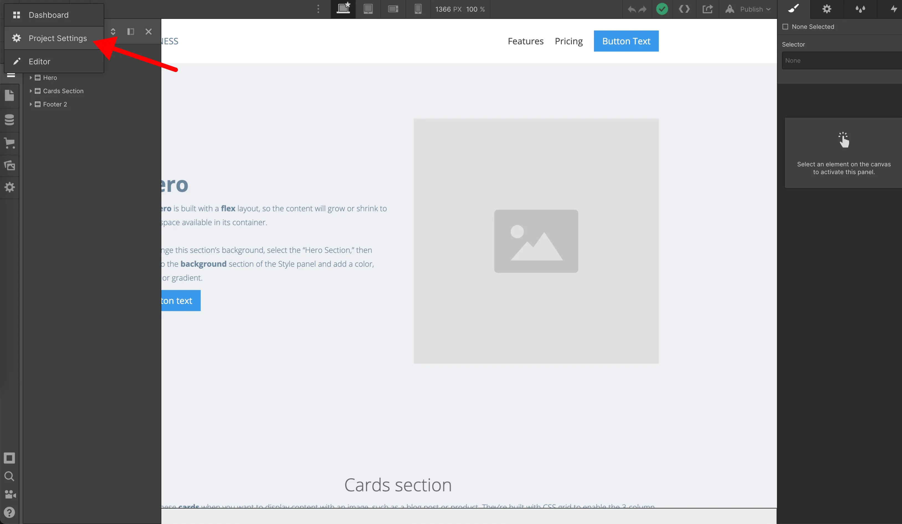

# Install on Webflow

### Before You Start

To add the Darwin tracking code to your [Webflow](https://webflow.com/) website you need a paid site plan. This is because Darwin is installed as "custom code" which is enabled once you upgrade.

### Get Tracking Code

Login to [Darwin's Dashboard](https://app.darwin.so/login) and visit "Tracking Code" in the navigation.

Copy the tracking code HTML that you'll find there.

### Visit Webflow Dashboard

[Login to Webflow](https://webflow.com/), click on the Webflow icon in the top left and go to "Project Settings".

### Add Custom Code

Click on "Custom Code"

Add the Darwin tracking code to the "Head Code" textbox and save changes.

### Publish Changes

Click "Publish" on your project settings, select the domain for the site listed in Darwin and click "Publish to Selected Domains".

### Verify Installation.

Once you've saved your changes, you can verify your install on the [Darwin dashboard](https://app.darwin.so).

