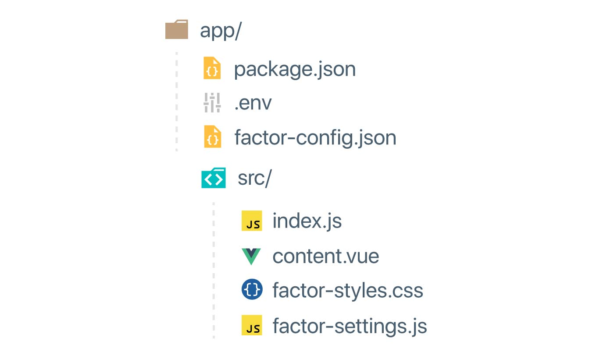

# App Structure

## Organizing Your App

The basic structure of Factor apps should be familiar to most Javascript developers. A simple app typically has the following basic structure:



Let's go through each of these files and what the do:

## Package Info

### package.json

This file is used to describe your application as an NPM package. Inside this file you should add:

```json
{
  "name": "myApp",
  "factor": {
    "target": "app"
  },
  "dependencies": {
    "@factor/core: ...
  }
}
```

## Public Config

### factor-config.json

Here you will store publicly accessible keys and information to configure your app. The `factor setup` command also writes configuration settings to this file. It also supports some overriding based on the environment that is running.

```json
{
  "myKey": "foo", // default myKey value
  "development": {
    "myKey": "bar" // value of myKey if NODE_ENV == development
  },
  "test": {
    "myKey": "baz" // value of myKey if FACTOR_ENV == test
  }
}
```

## Private Keys

### .env (dotenv)

For private configuration keys and information, Factor uses the standard [dotenv](https://github.com/motdotla/dotenv) library. This utility takes the values in this files and adds them to `process.env` at runtime. You should never commit this file to source control, treat it like a password.

```git
TOKEN_SECRET="SOME-LONG-TEXT-12345"
DB_CONNECTION="https://my-connection-string-etc"
```

## Source

### Root vs `src` folder

You can place code for you application in either the root of the directory or in a `src` folder. What determines this is the `main` value in your `package.json`. If the main value is in a subfolder, it is assumed this is where your source is.

## App Code Starts Here

The "main" file, typically `index.js`, is the entry point for applications business code. In this file you will add routes and other customization to get exactly what you want.

```js
import { addFilter, setting } from "@factor/tools"

addFilter("content-routes", routes => {

  // add or customize routes

  return routes
}
```

You can control how exactly this file gets loaded via the `package.json > factor > target` attribute. For example you can break out the entry for the app vs the server as follows:

```json
// package.json
{
  "factor": {
    "target": {
      "app": "index", // Loads index.js in webpack app
      "server": "server" // Loads server.js in cli and express server
    }
  }
}
```

## The Content Wrapper Component

## App Settings

## App Styles
