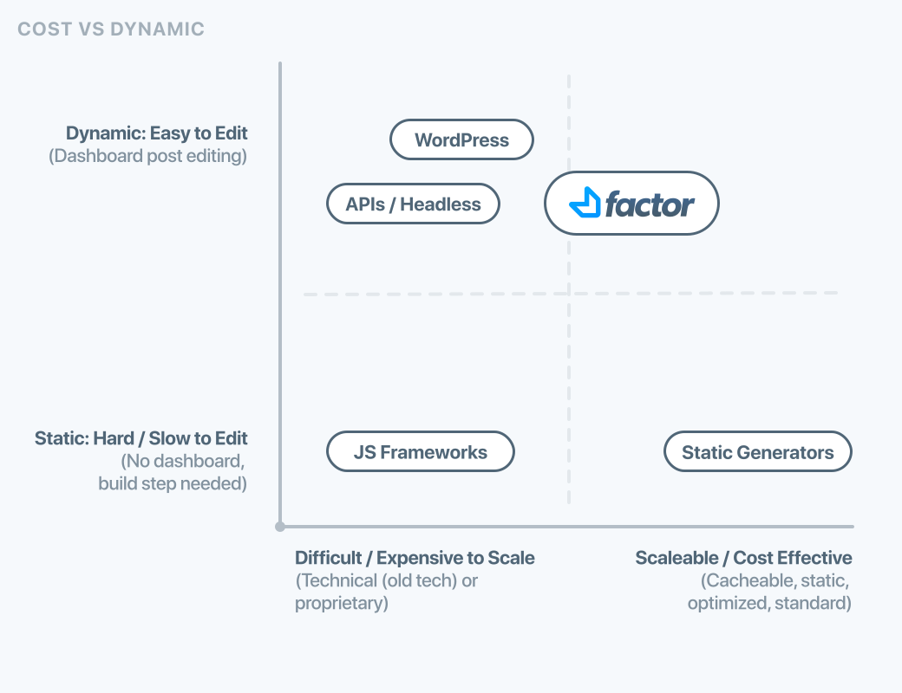

# Comparing Factor

## Overview

Today there are hundreds of technologies and frameworks to consider when building a web app. We realize that Factor may not be ideally suited for every use case. And in fact, we would prefer not to bloat the platform through attempting to cater to everyone.

Here we'll discuss some of the various development approaches and their advantages and disadvantages.

### The "Target" User

As discussed in the [Factor Introduction](./), Factor is designed for **front-end developers** (like us).

The Factor concept itself was created because of the wish list of features and ideas we wanted to see in a JS platform.

#### Goals

- **Designer friendly code only** (Abstract away painful-to-work-with tools.)
- **Useful theming that works**
- **Easy to install plugins**
- **No proprietary APIs or lock in**
- **Full-Stack Javascript**
- **No reinventing the wheel**

#### Non-Goals

- **No "magic"** - Things should not just happen without having to explicitly define the functionality. For example, routes should not auto generate. Magic creates bloat (as you modify and customize) and mysterious bugs.
- **No builders or drag-and-drop** - The concept of "no coding" is usually not what front-end developers want. They'd rather build things to a "standard" as opposed to learning proprietary (and often janky) drag and drop tools. (Note that extensions could easily provide this functionality.)

## Why choose Factor?

Factor is meant to be ideal for front-end oriented developers whose focus is on shipping great apps, not working on them.

It accomplishes this primary by focusing on helping extensions do more, and helping them to it with less work on your part.

- If you something like WordPress but want to use (or learn) a newer technology stack, and love Javascript.
- If you work with JS and JS frameworks, but want to spend less time "reinventing the wheel", debugging and reading technical docs.

## Who should NOT choose Factor

Factor is built for front-end developers who don't mind a little coding, but just want to deal with the "fun parts" of coding (not technical docs or debugging!).

This means Factor development isn't for the completely non-technical folks, (although it is easy for a Factor developer to create something that is).

## Comparisons

### Comparison Charts

There are some well known tradeoffs in the web app world. For certain people, Factor has unique advantages in comparison to alternatives on the market.

#### Latest Tech and Extension Power

WordPress has a powerful extension system that is very mature and easy to use. Factor used this system as inspiration in developing it's own.

However, Factor leverages all the benefits of the latest technology. Like portability, speed, async, etc..

#### Dynamic Features vs Costs / Scale

There is a well known tradeoff between features which could be considered "dynamic" like the ability to edit posts/pages on the fly. Or the ability to have authentication and dashboard oriented features.

These sort of features require server based resources which inherently require more resources to scale when compared to static files that are generated and then simply served.

Factor is meant to be fully dynamic, although static generator style features are available via a plugin. In comparison to "difficult to scale" tools like WordPress however, Factor uses newer technology and techniques to reduce scaling problems and cost.

### WordPress

**Advantages**

- Mature ecosystem
- 10000+ Plugins and Themes

**Disadvantages**

- Old technology stack (harder to develop with and scale)
- Slower performance
- Built for blogging as opposed to websites or apps

### JS Frameworks

**Advantages**

- Minimal structure
- Less "opinionated"

**Disadvantages**

- Difficult to extend
- Time spent reinventing the wheel
- More debugging time
- More code to manage

### JAMStack / Static Generators

**Advantages**

- Lowest cost to host (however, more expensive if using 3rd party APIs)
- No backend to manage
- Minimal server tech needed

**Disadvantages**

- Confusing and tedious "build and rebuild" editing
- No dynamic features like auth, endpoints etc.. without 3rd party tools (which mean cost + lock-in)
