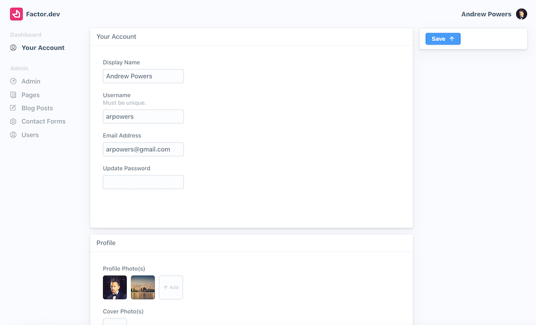

# Dashboard Setup

_By default, Factor includes a CMS-like post management system and dashboard. These features allow extension developers to create CMS oriented tools that are dynamic, consistent, and easy to manage._

## Overview

A web app usually needs the following:

- User Management and Authentication
- A Database System
- Image Storage

For many developers, setting this up can represent months of work and include many painful rewrites as you learn "best practices."

That's why Factor takes an opinionated approach to how to best handle these common services. Doing so allows us to create a platform on which extension developers can build, as well as helps you save many many days of debugging and pain.

To use the dashboard all you need is a [MongoDB connection string](https://docs.mongodb.com/manual/reference/connection-string/), which gives us the datastore needed to save data, do auth, etc.

From there, different plugins may require different config information. E.g. AWS credentials. But ultimately the system is super simple to work with and extend. Let's discuss things in more detail below...

## The DB Connection

The only thing that is required to get Factor's dashboard and post system running is a MongoDB/Mongoose compatible DB connection string. If you are not familiar with this, all you need to do is sign up for a service like [Mongo Atlas](https://www.mongodb.com/cloud/atlas) and they will walk you through the steps needed to get your string.

Once you have it, just add the string to your `.env` file under the variable `DB_CONNECTION` as follows:

```git
# .env - DB Connection (Mongo Connection String)
DB_CONNECTION="mongodb://db1.example.net:27017,db2.example.net:2500/?replicaSet=test"
```

To make it easier, you can also run `yarn factor setup` which includes a simple utility for adding this string along with any other configuration your app/plugins may need. More on that below.

## Users: Auth and Roles

### Token Setup

Json Web Tokens (JWTs) are a standard, simple and effective way of managing authentication for your users with Factor.

All that is needed to make JWTs work is a "token secret" used for encoding them on your server. To add it:

```git
# .env - Token Secret: Treat like a password, can be whatever you want
TOKEN_SECRET="SOME-LONG-STRING-WHATEVER"
```

### User Roles

Factor includes a basic user role system controlled via your `factor-config.json` file. To add your first admin users, you'll need to add them to this file directly (or using `factor setup` CLI command described below).

```json
// factor-config.json
{
  "config": {
    "roles": {
      "admin@email.com": "admin",
      "moderator@email.com": "moderator",
      "author@email.com": "author"
    }
  }
}
```

> **Note:** User account's email addresses must be successfully verified in order for admin privileges to be applied.

## Accessing Your Dashboard

With DB and auth setup, all you need to do is visit [localhost:3000/dashboard](http://localhost:3000/dashboard) and you should be asked to "login" or "signup." Just hit "signup" and cteate an account and you should be able to see your dashboard.

At first, the dashboard will be bare-bones. This is because you likely haven't been made an admin and you haven't installed any plugins. So as a first step, run `yarn factor setup` and add your email as an admin. (This writes info to your `factor-config`).

Inside the dashboard, on your 'account' page, you'll find a button to send yourself a verification email. If you haven't set up transactional email yet, then the output of this email will be logged to your console. Visit the link that was sent to verify your email.

Once you've added yourself as admin and verified your email address, you should be able to see the admin options as well as basic user level options in your dashboard.



## Essential Services

There are some services needed to power even the most basic apps:

### Transactional Email

Basic email is needed for notifications and critical account tools like 'forgot password.' For this reason, Factor includes a simple email system that is powered by the standard SMTP.

To set up, just add the following to your `.env` file (or run `factor setup`)

```git
# .env - SMTP connection info
SMTP_USERNAME="YOURUSERNAME"
SMTP_PASSWORD="---YOURPASSWORD---"
SMTP_HOST="your.host.com"

```

> **Note:** We recommend [AWS SES](https://aws.amazon.com/ses/) for SMTP email

### Image Storage

By default, Factor uses your DB for image storage, this is _not_ ideal for performance reasons. Ideally, Factor needs an image storage plugin to process and store images then return a URL to save in the DB.

#### S3 Plugin

While it is possible to use any image storage service to store your images, Fiction has created a simple plugin that uses [AWS S3](https://aws.amazon.com/s3/) for storage.

To install Fiction's S3 image storage plugin:

```bash
$ yarn add @factor/plugin-storage-s3
```

**Required S3 Configuration**

```git
# .env / AWS config info
AWS_ACCESS_KEY="YOURKEY"
AWS_ACCESS_KEY_SECRET="YOURSECRET"
AWS_S3_BUCKET="your-bucket-name"
```

## `$ yarn factor setup`

Factor setup reduces guesswork needed to configure your app.

To run it, enter the following:

```bash
$ yarn factor setup
```

From here you'll be provided with a listing of needed configuration, as well as tools for adding or changing existing configuration options.


