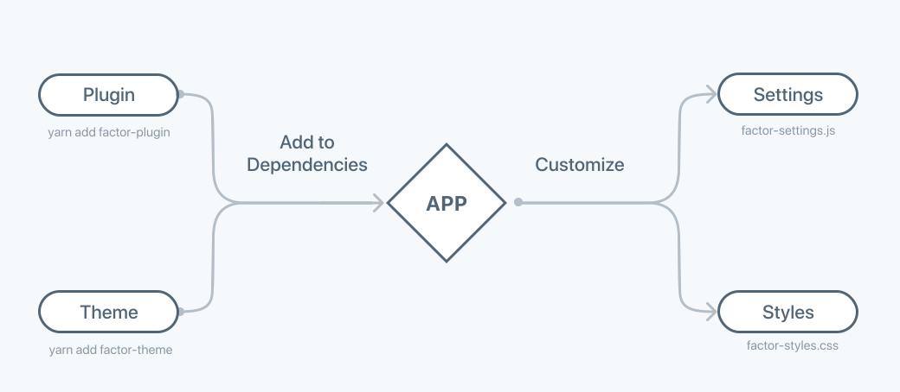

# Extending Factor

## Adding Extensions

Factor is an "extension-first" framework. Meaning it is itself a simple core system with first class support for extensibility by plugins and themes. Almost anything in Factor can be customized given the right plugin.

Factor is designed for "drop-in" extension. That means that to be "up and running" with new plugins and themes, all you do is run `yarn add my-extension`...

```bash
$ yarn add some-factor-plugin
```

When you run Factor, it detects your extensions and loads them for you. Extensions will then use Factor's filter and settings system to install and configure themselves.



## Customize Extensions

Once you've installed a plugin or theme, you'll likely want to customize it. To learn more read the doc:

[customizing things in Factor &rarr;](./customization)

## Create Your Own

### Plugins

> Plugins add new features and functionality.

The scope of Factor plugins is to deliver new features or functionality to Factor. For example, adding an SEO utility or bug-tracking middleware. Factor is designed to be extended, that's why you can do almost anything with a plugin.

Can't find the plugin you're looking for? Factor plugins are just NPM modules, so it's easy to create your own.

Learn more about [creating plugins &rarr;](./creating-plugins)

### Themes

> Themes are an opinionated starting point for your app.

You have the option of using themes in one of two primary ways:

- **Starting Point:** Use a theme as your app and customize its files directly. Thie approach sacrifices the ability to upgrade the theme for more ability to customize things.
- **Dependency:** If you use the theme as a dependency, you can easily upgrade it as new features are added.

The best way to think about a theme is as a more "opinionated" baseline for your app. For example, if you think Google Material is the best UI framework, you can start from the Factor Material theme.

Learn more about [creating themes &rarr;](./creating-themes)
