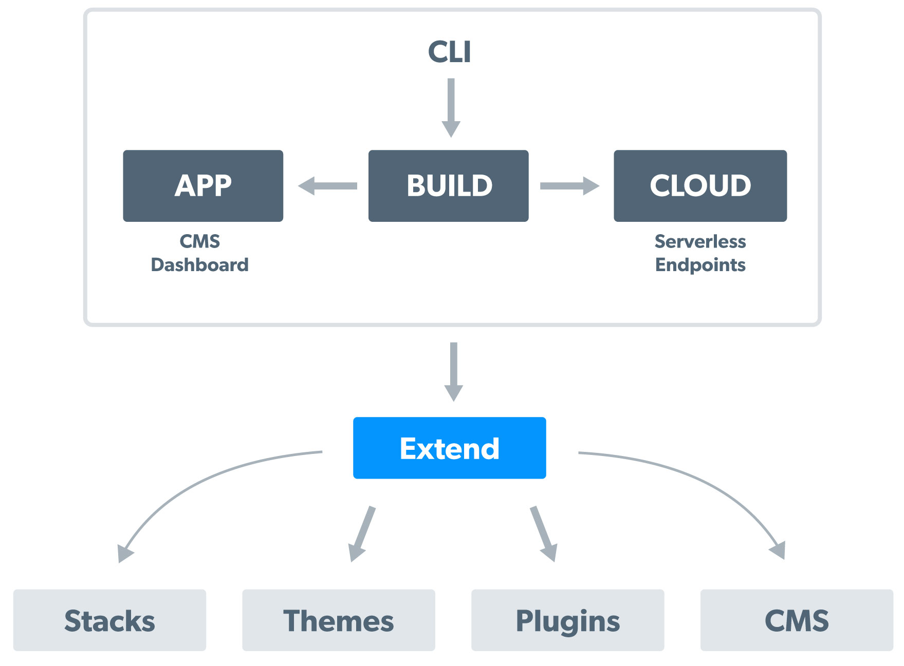

# Introduction
 
## [What is Factor?](#what-is-factor)
> Factor is a Javascript web application system that worries about best practices so you don't have to...  It is built on top of amazing open source tools like Node, Vue, MongoDB/Mongoose and it also built from the ground up for extension with themes and plugins.  Factor's unique focus is on tools for eCommerce and content management.

**Why Factor?** &mdash; 

Most developers goal is to ship production apps. But today, most developers spend their time doing painful rewrites, dealing with unforeseen complications and getting stuck with vendor lock-in. All this inevitably results in delays, wasted money and ultimately failure.

We faced this problem, and worked years to create a decent app architecture to avoid these problems. After many writes and rewrites this is what resulted in Factor.

It seems that many modern devs are facing similar issues and so we've open-sourced it in the hopes that it may be useful to you. 

Use Factor if you want to: 
- Avoid writing code that has been written countless times already
- Minimize vendor lock-in 
- Give your apps a rich CMS and eCommerce architecture 
- Use best practices

## [How it Works](#how-it-works)

You can think of Factor as a system that brings together the following:

- A Dashboard, CMS and eCommerce Features
- A Core Node/VueJS Framework
- An Drop-In Extensions System
- Build System and CLI for managing your app

#### [Features](#features)

- Dashboard and Page/Post Management System (optional)
  - Similar to WordPress' admin
  - User management / Authentication
  - Real time site editing (no builds and rebuilds)

- Comprehensive VueJS/NodeJS framework
  - Server-side-rendered (SSR) for Performance and SEO
  - Reactive 
  - Routes(vue-router), Stores(vuex), CLI, Builds

- Extensions System
  - Themes system for quickly creating beautiful apps
  - Stacks system for avoiding service learning curve and lock-in

## [Concepts](#concepts)

### [Framework](#build)

Factor, at its heart, is a system that coordinates different developer tools and environments to create a consistent and simple development experience. 

The purpose of the this is to abstract away all the configuration, bundling, file generation, etc.. so you can focus on **just building your app.**

Parts of the build system include: 
- CLI (Node)
- Local development server
- Webpack bundling system
- Extension and filter system

While in reality you'll be working across environments (cli, node, cloud, app(client/server)), the build system orchestrates this and makes it feel like a common VueJS/Javascript app.

[Learn how to add components and routes](./framework)

### [Themes](#themes)

In many platforms, Themes are critical in developing apps. However, theming is typically neglected in JS frameworks. With Factor this isn't the case. 

The scope of a Factor theme is to give you an advanced starting point for your app and it can save you a ton of time. Themes add or include extensions of their own, and include useful templates and UI tools.

The theme structure is the same as your application structure. This means you can use a theme as starting point or you can inherit from it by adding it in your factor-config file and as a dependency. Inheriting has the added benefit of the theme being 'updateable' which is not possible once you've edited it. 

[Learn more about themes](./themes)

### [CMS: Dashboard and Posts System](#cms)

Similar to WordPress, Factor extensions implement common patterns that most web apps benefits from which we call "CMS" features. These include: 

- User Dashboard
- Posts and Post Management (in Factor, and similar to WordPress, everything is a post - pages, users, docs, etc... )
- Admin Dashboard 
- Authentication
- Basic Data and Image Storage

These features build on top of Factor's core framework and build system and we believe are useful to wide array of projects.

[Learn more about the CMS](./cms)
 
## Ready For More?

We’ve briefly introduced the most basic features of Factor - the rest of this guide will cover them and other advanced features with much finer details, so let's dig in.