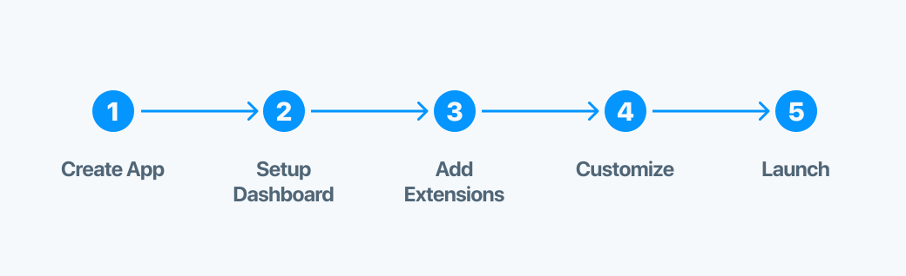

# Quickstart

## Overview

If you're already familiar with the basics of Javascript-driven apps (e.g. Node, NPM, etc...) then starting a new Factor app is straight-forward. The goal with this quickstart is to get you up-and-running in **less than 3-minutes**.

To install Factor, all that is really needed is to run `yarn add @factor/core` which adds Factor as a dependency and installs its packages. Although ideally, you'll want to configure your app according to the conventions used in Factor apps, which is what **create-factor-app** is designed to help you with.



### Before You Start

- Factor requires [Node.js](https://nodejs.org/en/) version 10 or above, as well as [Yarn](https://yarnpkg.com/en/) for dependency management.
- If you're using Windows you might need to install [standard build tools](https://github.com/felixrieseberg/windows-build-tools) which includes Python, etc.

## [Using `create-factor-app`](#create-factor-app)

To get started quickly, we've built a "starter kit" tool: [create-factor-app](https://www.npmjs.com/package/create-factor-app).

> Make sure you have [npx](https://www.npmjs.com/package/npx) installed (`npx` is shipped by default since NPM `5.2.0`)

```bash
npx create-factor-app <project-name>
```

or with Yarn:

```bash
yarn create factor-app <project-name>
```

Running this command will install Factor and start a guide that helps you create a starter app.

It will ask you a couple questions and then it will install and create a basic Factor app.

Once you've set up, the next step is to navigate to the project folder and launch it with:

```bash
cd <project-name>
yarn factor dev
```

Now your basic starter application should be running at [`localhost:3000`](localhost:3000)

## Next Steps

**Keep up the good work!**

Now that you have Factor running locally, the next step is to [setup your dashboard &rarr;](./dashboard-setup)
