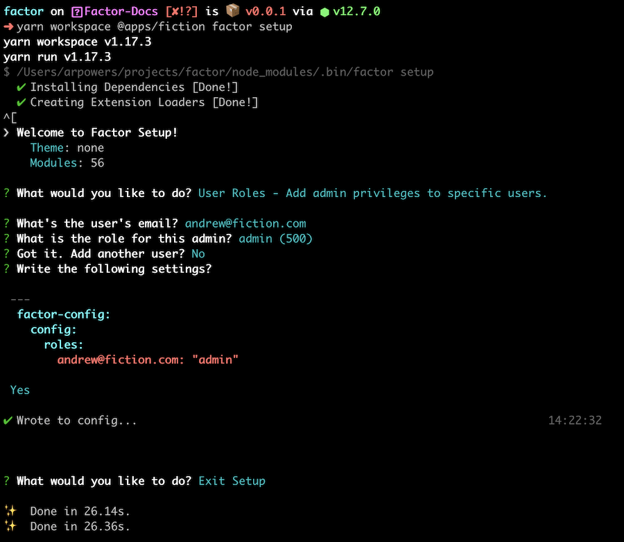

# Dashboard and Post System

> By default, Factor includes a CMS-like post management system and dashboard. These features allow extension developers to create CMS oriented tools that are dynamic, consistent, and easy to manage.

## Overview

A typical web app usually needs the following:

- User Management and Authentication
- A Database System
- Image Storage

For many developers, setting all this up represents months of work including many painful rewrites as you learn "best practices."

That's why Factor takes an opinionated approach to how to best handle these common services. Doing so allows us to create a platform on which extension developers can build, as well as helps you save many many days of debugging and pain.

To use the dashboard all you need is a [MongoDB connection string](https://docs.mongodb.com/manual/reference/connection-string/), which gives us the datastore needed to save data, do auth, etc.

From there, different plugins may require different config information. E.g. AWS credentials. But ultimately the system is super simple to work with and extend. Let's discuss things in more detail below...

## The DB Connection

The only thing that is required to get Factor's dashboard and post system running is a MongoDB/Mongoose compatible DB connection string. If you are not familiar with this, all you need to do is sign up for a service like [Mongo Atlas](https://www.mongodb.com/cloud/atlas) and they will walk you through the steps needed to get your string.

Once you have it, just add the string to your `.env` file under the variable `DB_CONNECTION` as follows:

```git
# .env
# Mongo Like Connection
DB_CONNECTION="mongodb://db1.example.net:27017,db2.example.net:2500/?replicaSet=test"
```

To make it easier, you can also run `yarn factor setup` which includes a simple utility for adding this string along with any other configuration your app/plugins may need. More on that below.

## Basic Auth

Now that you have your DB set up, all you need for users and auth is to add a "token secret."

```git
# .env
# Token Secret: Treat like a password, can be whatever you want
TOKEN_SECRET="SOME-LONG-STRING-WHATEVER"
```

Factor uses Json Web Tokens to handle all typical authentication needs. Here's how it works:

- When a user logs in a token is created using their ID along with the token secret you've added.
- This token is sent along with all server requests
- The server then decodes the token using the secret, which securly tells the server the ID of the logged in user

## Accessing Your Dashboard

With DB and auth setup, all you need to do is visit [localhost:3000/dashboard](http://localhost:3000/dashboard) and you should be asked to "login" or "signup." Just create an account and you should be able to see your dashboard.

At first, the dashboard will be bare-bones. This is because you likely haven't been made an admin and you haven't installed any plugins. So as a first step, run `yarn factor setup` and add your email as an admin. (This writes info to your `factor-config`).

Inside the dashboard, on your 'account' page, you'll find a button to send yourself a verification email. If you haven't set up transactional email yet, then the output of this email will be logged to your console. Visit the link that was sent to verify your email.

Once you've added yourself as admin and verified your email address, you should be able to see the admin options as well as basic user level options in your dashboard.


## Essentials: Email & Storage

There are some services needed to power even the most basic apps:

- **Email: SMTP Service**
  Basic email is needed for notifications and critical account tools like 'forgot password'

- **Storage: Image hosting**
  In order to provide efficient image handling, you'll need to add an image storage service plugin to Factor.

## `$ yarn factor setup`

Factor setup reduces guesswork needed to configure your app.

To run it, enter the following:

```bash
$ yarn factor setup
```

From here you'll be provided with a listing of needed configuration, as well as tools for adding or changing existing configuration options.


