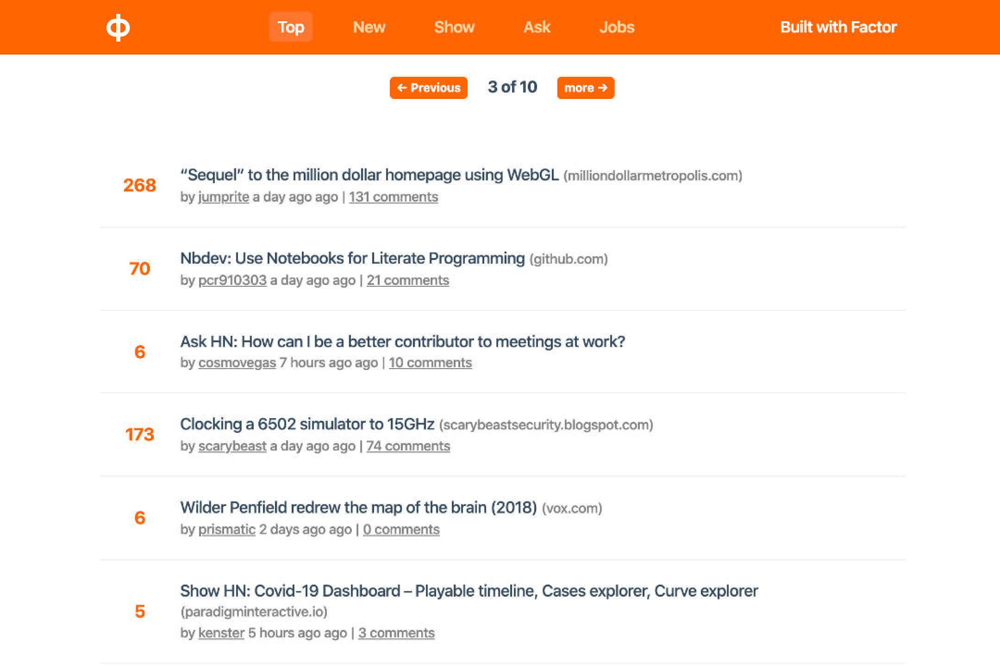

# Hacker News Clone

This example is a Hacker News clone built using Factor as a framework. It is a good showcase of the backend functionality, as well as how to work with the store and SSR.

## Purpose

This example project was designed to showcase Factor as a framework. It doesn't make use of the dashboard or the CMS features.

However, it has the following features and boilerplate:

- Uses flat store + cache (using `stored` and `storeItem` utilities)
- Supports multiple views and routes
- Complete Vue SSR framework
- Real-time updating with animation
- Meta handling with image, title, icon/favicon
- ESlint, Prettier, TypeScript configured

## Demo

Here is a [live demo of the project](https://hacker-news-example.factor.dev/v/top)

## Code

You can find the [code for this project on Github](https://github.com/fiction-com/factor-hacker-news).
