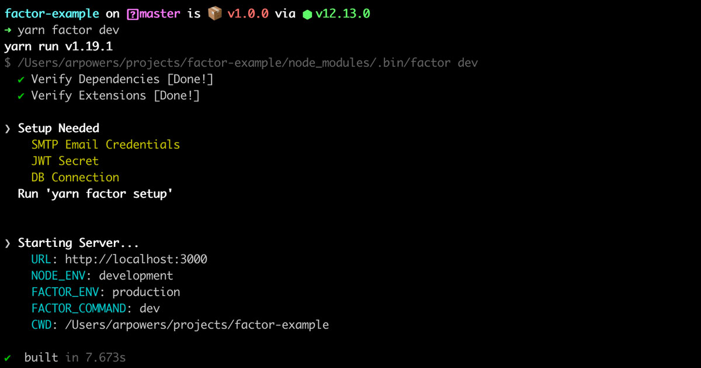

# Commands and CLI

A key part of using Factor is working with its command-line-interface (CLI). The CLI is used to help orchestrate tasks across the system.

## Getting the CLI

1. Add Factor by adding `@factor/core` as a dependency in your project `npm add @factor/core`
2. Run the initial `npm install` on the directory to install dependencies
3. You should now have the CLI available in that directory using `npx factor [command]`

## Run Development Server

The aptly named `dev` command starts your local development server and runs Factor in development mode.

```bash
# Run dev server
npx factor dev
```



### Dev Server Options

- `--static` - Use static files instead of Webpack's default memory filesystem (virtual files).
- `--server` - Server development mode. Restart the server on file changes.

## Build Distribution Files

The `factor build` command will generate all production files and place them in the `dist` folder within your app. These are the files you'll be serving in production.

```bash
npx factor build
```

## Serve in Production

Once you've built your production files, you'll typically want to serve them.

```bash
npx factor build
```

To build files and then serve them run `factor start`

```bash
npx factor start
```

### Setup Helper

Factor provides a special `setup` helper command that helps you configure any keys or information needed by Factor and/or plugins you've installed.

```bash
# Run setup utility
npx factor setup
```

The setup utility can be used to add admin users, or to configure various services. It is often extended by plugins as well.

### Common CLI Options

- `--PORT` - Set the desired port to serve your application. (Default: 3000)
- `--ENV` - Set the `FACTOR_ENV` environmental variable. (Default: NODE_ENV)
- `--DEBUG` - Outputs additional debugging information into your console

## Extensions

Extensions often add or extend the functionality in the CLI. To learn how to do this yourself, check out [extending the CLI &rarr;](./extend-the-cli)
