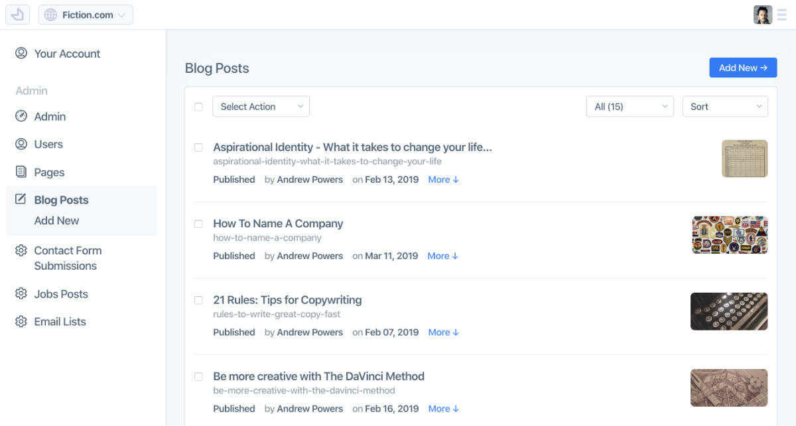

# Setting Up Your Essential Services

Now that you've gotten your project set up, now you need to setup a few "essential services" for critical functionality like your database, image storage, transactional email and authentication. The good news is Factor makes this easy.



## Your Database

With Factor, there are two ways information is saved: your static files (git) and your database. Each has it's own role in your app.

Most CMS oriented features save their information in your database as this is the fastest and most efficient way to work with information in production.

When you initially install Factor in a project, it needs to know how and where to connect to your MongoDb database. And if it doesn't have this information it will default to the Factor demo database (which resets itself every 30 minutes).

### Getting a Connection String

The method of giving Factor this information is via a [MongoDB connection string](https://docs.mongodb.com/manual/reference/connection-string/). Which is a simple URL-like format for telling Factor exactly where and how to connect.

There are many ways to setup a MongoDB database. It's easily installed via container on the cloud or in virtual machines; you can also run it locally on your own computer or server. Each method will have a straight forward way of getting a connection string.

#### Mongo Atlas

For many users, the easiest way to get a DB is likely using [Mongo Atlas](https://www.mongodb.com/cloud/atlas). This is a hosted and managed service by the creators of MongoDb itself and it's very cost efficient (and scalable) to use with Factor.

The steps to get a connection string are as follows:

1. Set up an account at [Mongo Atlas](https://www.mongodb.com/cloud/atlas)
1. Whitelist your IP (or all IPs)
1. Create a new Database with a single collection called `posts`
1. Create a user that can access this database
1. Get the connection string and add to Factor `.env` (below)

### Adding Your Connection to Factor

Once you have your connection string, just add it in your `.env` file under the variable `DB_CONNECTION`.

```git
# .env - DB Connection (Mongo Connection String)
DB_CONNECTION="mongodb://db1.example.net:27017,db2.example.net:2500/?replicaSet=test"
```

## Authentication and Roles

Factor includes user authentication and user role system that requires some simple setup.

### Authentication - Set your JWT secret token

Factor auth works via Json Web Tokens (JWTs) a secure, simple, and standard technique to manage user sessions.

All that is needed for JWTs to work correctly is a special "token secret." This secret is used to create special tokens that users can send to your server when they make requests. Factor then decodes this token and makes sure the user is who they say they are. To set the token secret just add the `TOKEN_SECRET` variable in your `.env` to any string.

> **Important -** Treat your production `TOKEN_SECRET` as a top security password. With this information any user account can be hijacked.

In your `.env` your secret looks like this:

```git
# .env - Token Secret: Treat like a password, can be whatever you want
TOKEN_SECRET="SOME-LONG-TEXT-12345"
```

### Setting Admins Users

Factor has a simple user role system that is designed to serve most "privilege based scenarios. To get this system started you first need to create some "admin" users that have the capabilities needed to promote other users from the dashboard.

To add these initial admin users, you can add a list of emails in your `package.json` under `admins`:

```json
{
  // package.json stuff
  "factor": {
    // factor stuff
    "admins": ["youremail@example.com", "anotheremail@example.com"]
  }
}
```

or if you like in your `.env` file under `FACTOR_ADMINS`.

```git
# .env
FACTOR_ADMINS="youremail@example.com,anotheremail@example.com"
```

Now once a user with that email is logged in and verified, they will have admin access in the Factor dashboard.

### User Roles

Inside Factor there is a concept of user roles assigned to users. Each role is assigned an access level (0 - 500) and given privileges related to the scope of that role:

- **Admin (500)** - All privileges
- **Moderator (300)** - Ability to manage and edit posts, users
- **Editor (200)** - Can write and edit their own posts and others
- **Creator (100)** - Can write and edit their own posts
- **Member (1)** - Logged in, can manage own account settings
- **Anonymous (0)**

> _Developer Note:_ Each post type can define the abilities assigned to each role. Additional roles can be added via filter.

#### Promoting Users to Roles

If you are an admin user, then you will have the right to "promote" other users in the CMS directly from the dashboard. You can find this functionality under `dashboard > users > select action`.

## SMTP Email

A key part of a CMS is the ability to send email notifications for important events, notifications and confirmations. These are typically called "transactional emails."

Factor has a built in API for transactional email via SMTP which is a very cheap and standard way to send professional email.

There are many many services that provide SMTP email. At Fiction, we use both [Amazon SES](https://aws.amazon.com/ses/) and [Mailgun](https://www.mailgun.com/) for various application. Both are quite easy to setup.

Once you've figured out who you want to handle your email, then all you'll need is a `SMTP_USERNAME`, `SMTP_PASSWORD`, `SMTP_HOST` and optionally an `SMTP_PORT`. Then just add them to your `.env`...

```git
# .env - SMTP connection info
SMTP_USERNAME="---YOUR SMTP USERNAME---"
SMTP_PASSWORD="---YOUR PASSWORD---"
SMTP_HOST="smtp.example.org"
SMTP_PORT=587
```

## Image Storage

As opposed to old school CMS' that stored images on your server, good [12-Factor applications](https://12factor.net/) need to have an off-server image hosting/storage service. This decouples your images from your app and is generally good practice.

Factor can easily work with any image hosting service. A specific service just requires a standard plugin that hooks into uploads and returns the end URL for storage in your database.

#### AWS S3 Plugin

The clear leader in image storage is [Amazon S3](https://aws.amazon.com/s3/). For this reason, we recommend this platform and have created a Factor plugin that is easily installed and configured.

To install [Fiction's S3 image storage plugin](https://factor.dev/plugin/s3-cloud-storage):

```bash
npm add  @factor/plugin-storage-s3
```

Once you've installed this plugin all you need to do is add some basic configuration information from your S3 account. To setup your account:

1. Signup at [Amazon S3](https://aws.amazon.com/s3/) and visit your console
1. Create a storage bucket
1. Make sure files added to this bucket are publicly accessible

Once you've done that, you should also have a `AWS_ACCESS_KEY`, an `AWS_ACCESS_KEY_SECRET` and the name of your bucket `AWS_S3_BUCKET`. In your `.env` it will look like this.

```git
# .env / AWS config info
AWS_ACCESS_KEY="KEY"
AWS_ACCESS_KEY_SECRET="SECRET"
AWS_S3_BUCKET="your-bucket-name"
```

Once this is setup, you should h
