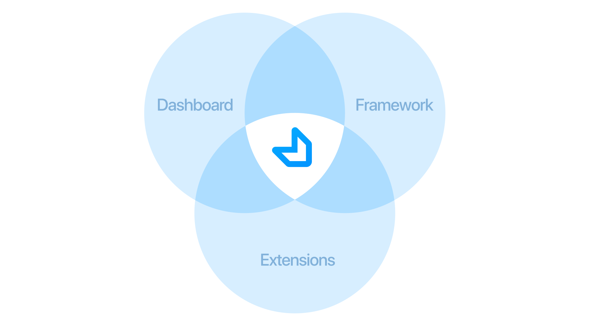

# Introduction

## Overview

**Factor** is a web application platform built on the VENM Stack ([VueJs](https://vuejs.org), [Express](https://expressjs.com), [NodeJS](https://nodejs.org/en/), [MongoDB](https://github.com/mongodb/mongo)).

Its purpose is to help you ship apps as quickly by reducing the amount of time you'll need to spend reinventing the wheel as well as reducing the amount of time and risk associated with creating your own application stack.

## Who Should Consider Factor

The goal of Factor is to help front-end Javascript developers ship web apps they can be proud of.

If you work with Javascript and spend lots of time doing rewrites, dealing with bugs and worrying about vendor lock-in then Factor is likely built for you.

## Goals

- Minimize painful coding and debugging
- "One-click" plugin installation and configuration (`yarn add ...`)
- Robust theme system
- Reduce the need to "reinvent the wheel"
- Minimize vendor lock-in
- Create a simple and elegant development experience
- Follow modular and minimal design patterns

## Core Idea

Factor is a combination of the following:

- An extension system
- A "Universal" Javascript framework
- Dashboard and data-model

## Next Steps

We'll dive into the details of the dashboard, data model, plugins, themes and framework in a bit.

If you haven't installed Factor yet, let's move on to the [Factor Quickstart &rarr;](./quickstart)
