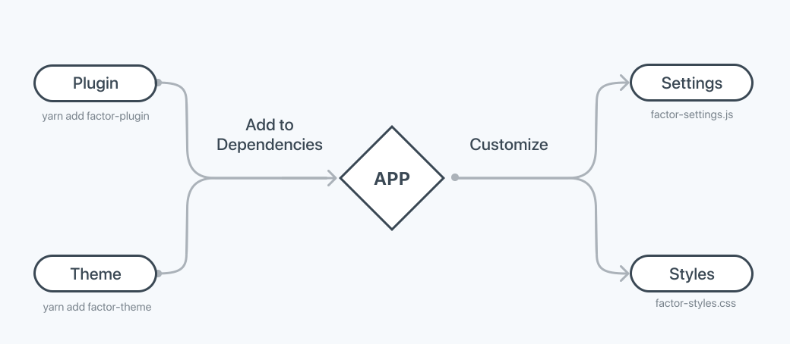

# Plugins and Themes

## Overview

Factor has a drop-in extension system controlled by your app's dependencies.

This allows you to activate a new extension just by adding it with the command `yarn install the-plugin`.

Once activated plugins are then designed to be customized via `factor-settings`, `filters` and CSS variables.



### Installing A Plugin

```bash

# Core Factor plugins use `@factor`
yarn install @factor/plugin-example

# Third-party plugins
yarn install factor-theme-example

```

## Customize Plugins

In most cases, you'll want to modify or customize Factor plugins to suit your needs.

While each plugin has it's own approach to customization, Factor provides many tools to make the process intuitive.

- The first thing to do is to read the `README` associated with the plugin you've just installed for an overview of customization options.
- You'll want to be familiar with common Factor customization techniques. Learn more here: [customizing things in Factor &rarr;](./customization)

## Creating Plugins

Factor is designed to be extended and with Factor's plugin interface it's easy to create awesome new plugins for internal use or distribution.

Since this is a bit more technical, we've moved this to its own doc.

[Creating Factor Plugins &rarr;](./create-plugins)
