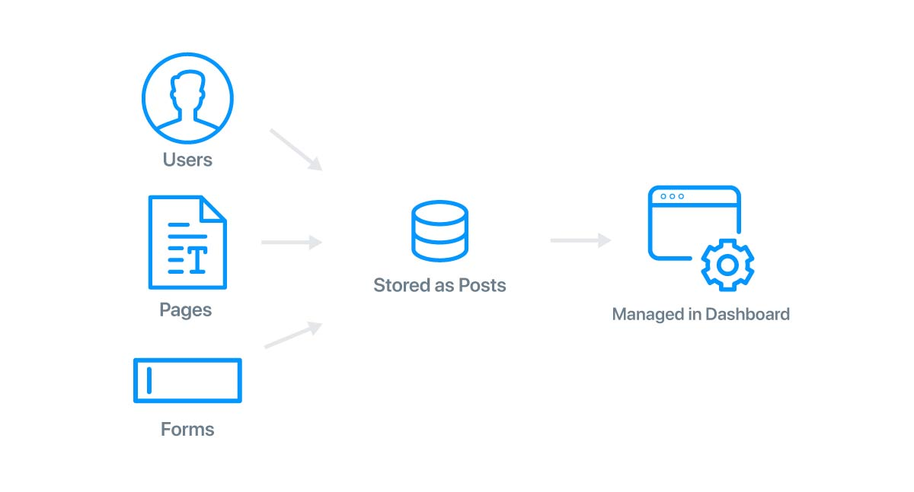

# Posts and Page Templates

Factor includes post and page management system that is useful is a wide variety of scenarios.

## Using Posts

Everything in Factor is essentially a "post" this means users, pages, job postings, blog posts, are all just varieties of the same thing.

Every time a plugin or extension adds a new "post type," Factor automatically detects this and adds the needed management functionality to your dashboard.



## Adding A Page

To add a new page to your app:

1. Visit your dashboard [localhost:3000/dashboard](http://localhost:3000/dashboard) and login
1. Click Pages &rarr; Add New
1. Add settings for your page including URL (permalink) and content
1. At bottom, select a page template

## Creating New Page Templates

Use the `addPageTemplate` function to add new page templates:

- `slug` - Unique identifier for your template,
- `component` - Page template component that should be loaded.
- `name` - Name of the template

```js
import { addPageTemplate } from "@factor/templates"
addPageTemplate({
  name: "My Landing Page",
  slug: "landing-page",
  component: () => import("./tpl-landing-page")
})
```

## Adding Template Settings

Page templates support creating options of the following types:

- text
- textarea
- sortable (creates an array)
- select

Inside your page template Vue components, add a few options. The example below adds headings, as well as an array of boxes with icons and text of their own.

```js
export default {
  // ...other component code
  computed: {
    post() {
      return stored("post") || {}
    }
  },
  templateSettings() {
    return [
      {
        input: "text",
        label: "Heading",
        description: "Primary page heading",
        _id: "pageHeading",
        default: "Landing Page Template"
      },
      {
        _id: "boxes",
        input: "sortable",
        label: "Feature Boxes",
        description: "Some feature boxes",
        default: [{ __title: "Box 1" }, { __title: "Box 2" }],
        settings: [
          {
            input: "text",
            label: "Heading",
            _id: "heading",
            default: "Box"
          },
          {
            input: "image-upload",
            label: "Icon",
            _id: "icon"
          }
        ]
      }
    ]
  }
  // ...other component code
}
```

### Using The Settings

To reference the values provided be the options:

1. Make sure you've added a `post` computed property to your component.
2. Reference settings with the format `post.settings[_id]`

```html
<template>
  <div class="landing-page">
    <div class="feature">
      <div class="feature-content">
        <h1>{{ post.settings.pageHeading }}</h1>
        <factor-btn size="large" btn="primary">Button</factor-btn>
      </div>
    </div>
    <div class="feature-boxes">
      <div v-for="(box, i) in post.settings.boxes" :key="i" class="box">
        <div v-if="box.icon" class="box-icon">
          
        </div>
        <div class="box-heading">{{ box.heading }}</div>
      </div>
    </div>
  </div>
</template>
```
