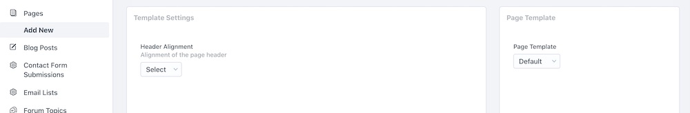

# Custom Page Templates

You can create custom page templates in Factor that can then be customized with the [template settings API](./template-settings). Let's learn how to create them.

## Creating A Page Template

To add a new page template, just use the `addPageTemplate` function.

```js
import { addPageTemplate } from "@factor/api"

addPageTemplate({
  slug: "example",
  component: () => import("./tpl-landing-page.vue"),
})
```

This function registers the template and associates it with a component. Inside the component is where the bulk of the design and configuration work will take place.

## Template Component

Inside the template component, you can add settings via the `templateSettings` property on the component. These settings should follow the [template settings API](./template-settings).

From there, the value of the settings will be added to the post associated with the page (`page` post type), under the property of `settings`. In the example below, we expose the settings to the template with the `settings` computed property.

```html
<template>
  <div class="example-template">
    {{settings.exampleSetting}}
  </div>
</template>
<script>
  import { stored } from "@factor/api"

  export default {
    computed: {
      post() {
        return stored("permalink") || {}
      },
      settings(this: any) {
        return this.post.settings || {}
      },
    },
    templateSettings() {
      return [
        {
          _id: "exampleSetting",
          input: "select",
          label: "Example",
          description: "Shows example setting",
          list: ["foo", "bar"],
          _default: "foo",
        },
      ]
    },
  }
</script>
<style lang="less">
  .landing-page {
    // styles
  }
</style>
```

## On The Dashboard

Once you've set up the template along with the component, you should be able to see it under the **page** > **edit** panel in the dashboard.

If you've added template settings, you'll be able to see them as well once you've selected your template.


