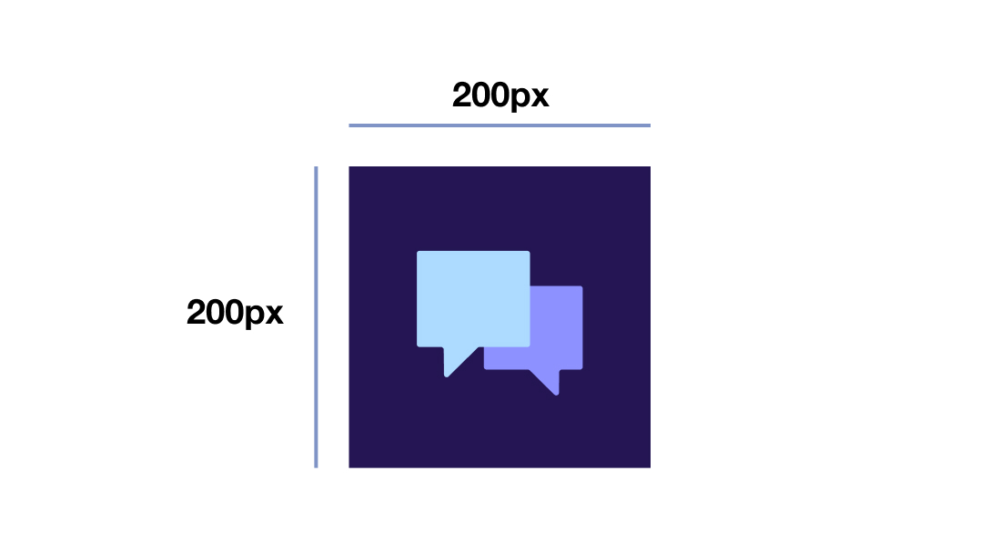
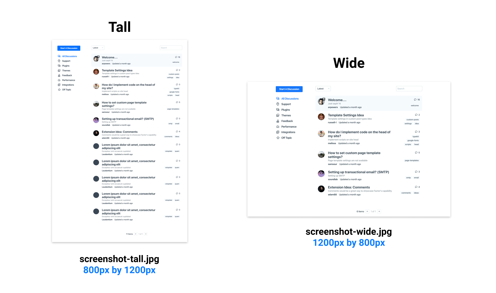

# Extension Standards and Guidelines

To encourage high quality extensions that are easily referenced, reviewed, and ultimately used, Factor provides some straight-forward guidelines. The ultimate goal being to create an amazing experience for end-users and developers alike.

In this guide we'll cover:

- **Screenshots** (`icon.svg` and `screenshot-[type].jpg`)
- **Metadata** (`package.json`)
- **Documentation** (`README.md`)

## Extension Icon

Add an icon to your extension for use in listings and grids shown to users.

- Use a square SVG file called `icon.svg`
- Place in root of extension
- Should be 200px by 200px by default

## Extension Screenshots and Icon

Once you've got your plugin or theme working, it's time to add some screenshots. If you plan on distributing your extension on [Factor.dev](https://factor.dev/plugins) these are used to show of your apps functionality. But at any rate, it's good to have screenshots in a standard size no matter where you'd like to share your extension.



### General Screenshot Guidelines

- To add screenshots, add them in the **root** directory of your extension.
- Typically you should use `.jpg` or `.png` files. Although others are currently supported.
- Screenshots should show your extension at its best. Add images and content to give users the full experience.
- Multiple screenshots can be added by adding a number to the screenshots name: `screenshot-wide-2.jpg, screenshot-wide-3.jpg`
- Screenshots are identified by adding `screenshot` into the name of a file. Standard screenshots should meet guidelines as discussed below.

### Standard Sizing and Orientation

- **Tall screenshots**

  - Should have an aspect ratio of **2:3**.
  - Recommended dimensions are **800px by 1200px**;
  - Should be named `screenshot-tall.jpg` or `screenshot-tall.png`

- **Wide Screenshots**
  - Should have an aspect ratio of **3:2**.
  - Recommended dimensions are **1200px by 800px;**
  - Should be named `screenshot-wide.jpg` or `screenshot-wide.png`

You can add screenshots in other sizes but don't add `wide` or `tall` to the file name. E.g. `screenshot-whatever.jpg`



## Extension Metadata

Metadata is needed to provide information about your extension. For example, it's name, description (aside from the readme), and so on.

This is added using your standard `package.json` file.

Below is a standard Factor extension `package.json` file.

```json
{
  "name": "@factor/plugin-my-example",
  "description": "A quick description of my extension",
  "version": "1.7.10",
  "license": "MIT",
  // For author links
  "author": {
    "name": "Fiction",
    "email": "factor@fiction.com",
    "url": "https://www.fiction.com"
  },
  "factor": {
    "load": ["app", "server"], // Main file loading
    "extend": "plugin", // plugin or theme
    "title": "My Example Plugin", // presentation title of extension
    "permalink": "example-factor-plugin", // (optional) permalink for plugin
    "category": "example", // category to add extension to
    "themeColor": "#E90000" // the theme color of your extension, should match icon.svg background
  },

  // Repository allows us to show a link to the extension's repo
  "repository": {
    "type": "git",
    "url": "https://github.com/fiction-com/factor/tree/development/@plugins/plugin-forum"
  },
  // Where to file bugs
  "bugs": {
    "url": "https://github.com/fiction-com/factor/issues"
  },
  // The home page for the extension
  "homepage": "https://factor.dev/plugin/forum-factor-plugin",
  "dependencies": {},
  // Keywords are used as tags
  "keywords": ["factor", "factor-plugin", "forum", "discussions", "topics", "categories"]
}
```

## Extension Documentation

They say "a feature doesn't exist until it's well documented," and our experience is in agreement with that. When you've created a working extension, you should also take documentation seriously if you'd like people to use it.

Documentation for your extension should exist in long-form in the `README.md` file in the root file of your extension.

Here is what you should cover in that file.

- **Purpose and Benefit**
  How would someone expect to use your plugin? What problem does it solve. The reason someone will actually use your extension is not the extension itself but the problem it solves. So make sure to take you time here.

* **Installation**
  How do people install and start using your extension? What should they expect? We recommend a step by step list. If you can provide a video or screenshots then that goes a long way towards helping someone be successful with your work.

- **Settings**
  Make sure you cover all the available settings or categories of settings for your extension. Sometimes users can be confused by what settings do; so provide some context for the purpose and effect that changing settings can have.

  You may want to point users also at your `factor-settings` file for reference.

* **Advanced Customization**
  Many times there are things that can be customized by advanced users that want to go over and above using settings. Provide broad guidelines on how this should be accomplished.
