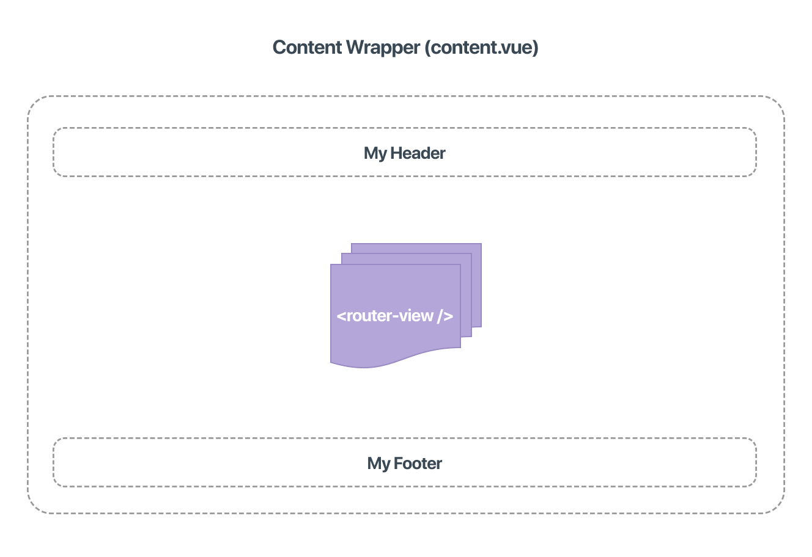

# The Content Wrapper

The `content.vue` component wraps your front-end content and allows you to add global elements to your app.

Use it to add elements that are visible on all pages of your site like navigation or a footer.



## Adding a Content Wrapper

To add a `content.vue`, just place it in the source folder of your app, Factor will detect it automatically on build. And no further steps are necessary.

However, automatic detection is considered "magic" and known to be a bad practice since it's hard to trace what is happening. Therefore, we recommend you set the content component manually with `factor-settings`.

```js
// src/factor-settings
export default {
  app: {
    components: {
      content: () => import("./content.vue"),
    },
  },
}
```

## Using the Content Wrapper

The only requirement in the wrapper is a Vue `router-view` component (which shows all your front-end views.)

From there, you can add any global functionality and UI that you'd like. In the below example, we add a `header` and `footer` component.


```html
<template>
  <div class="my-app-content">
    <my-header />
    <div class="main">
      <router-view />
    </div>
    <my-footer />
  </div>
</template>
<script>
  export default {
    name: "ContentWrap",
    components: {
      myHeader: () => import("./header.vue"),
      myFooter: () => import("./footer.vue"),
    },
  }
</script>
```

## Global Code

In addition to global components, you can use the content wrapper to set global code and styles.

For example, you can [add meta information](./metainfo) like `titleTemplate` and default meta `image`. This creates a standard title format for all front-end pages.

```html
<template>
  <!-- wrapper template -->
</template>
<script>
  export default {
    // .. other global stuff
    metaInfo() {
      return {
        titleTemplate: "%s - My App",
        image: require("./meta-image.jpg"),
      }
    },
  }
</script>
```

## Global Styles and Variables

Since the content wrapper is available on all front-end pages, it's ideal for setting global styles and CSS variables.

Since the wrapper component lies within the `body` of your HTML, use the `html.factor-app` specifier to wrap your global styles.

```html
<template>
  <!-- wrapper template -->
</template>
<script>
  // wrapper scripts
</script>
<style lang="less">
  html.factor-app {
    --color-text: #34495e;
    --color-primary: #f60;
    --font-family-primary: -apple-system, BlinkMacSystemFont, "Segoe UI", Roboto, Oxygen,
      Ubuntu, Cantarell, "Fira Sans", "Droid Sans", "Helvetica Neue", sans-serif;
    font-family: var(--font-family-primary);
    --font-weight-normal: 500;
    --font-weight-bold: 700;
    --color-bg: #ffffff;
    --color-border: #eee;
    font-size: 16px; // 1rem
    font-weight: var(--font-weight-normal);
    background-color: var(--color-bg);
    margin: 0;
    padding-top: 55px;
    color: var(--color-text);
  }
</style>
```
