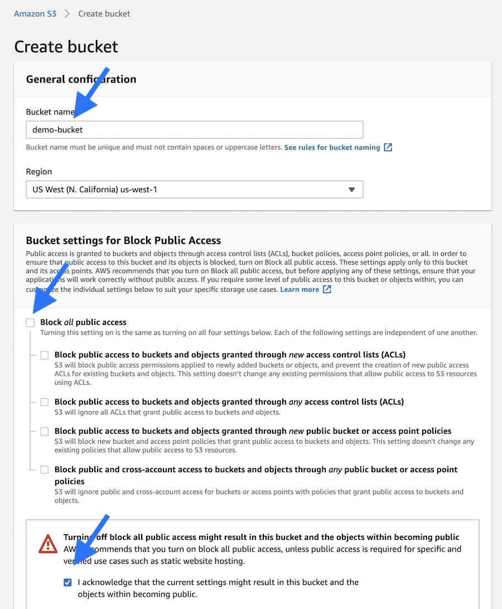

# Image Storage With AWS S3

[Amazon S3](https://aws.amazon.com/s3/) is one of the easiest and most standard storage services out there. We use S3 at Fiction, and we recommend it for storing images in your Factor application.

## The S3 Plugin

Factor has a plugin designed to enable S3 for image storage: [S3 plugin](https://factor.dev/plugin/s3-cloud-storage). The first step is to install it. 

```bash
npm add  @factor/plugin-storage-s3
```

This plugin will handle everything for you once installed. However you still need to provide it working S3 credentials. 

## Create an AWS Account 

If you don't have one already, create an account at [AWS](https://aws.amazon.com/s3/) and visit your console.

## Create a Storage Bucket

S3 has the idea of buckets, essentially folders for storing static files.  You'll need to create a bucket for use with Factor and get its unique name. 

In AWS console go to **S3** > **Create Bucket**. 


Then, enable public access as images are statically hosted and publicly accessible.




## Get Access Key / Secret

Next you'll need to get your AWS access key and secret for a privileged user. 

Go to **AWS Console** > **IAM** > **Users**. 

Then create a user. 


And then create an access key. Make sure to get the key and secret for use in `.env`. 


## Add to `.env`

Once you've done that, you should also have a `AWS_ACCESS_KEY`, an `AWS_ACCESS_KEY_SECRET` and the name of your bucket `AWS_S3_BUCKET`. 

In your `.env` it will look like this.

```bash
# .env / AWS config info
AWS_ACCESS_KEY="KEY"
AWS_ACCESS_KEY_SECRET="SECRET"
AWS_S3_BUCKET="your-bucket-name"
```
