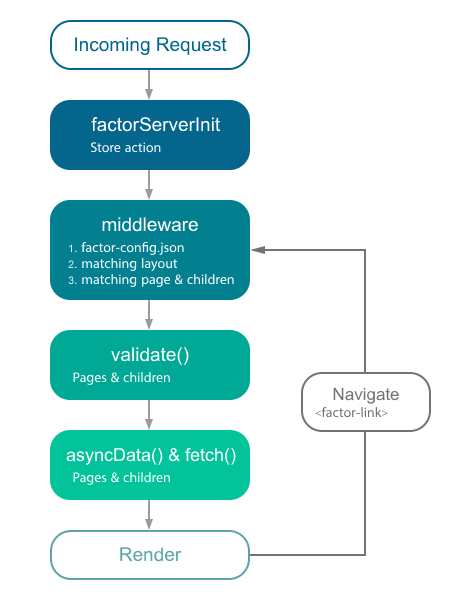

# Introduction

Factor.js is a framework for creating Vue.js applications, you can choose between Universal, Static Generated or Single Page application.

## [What is Factor?](#what-is-factor)
Factor is a Serverless Framework. In the documentation you will learn how to install it, how to use the interface and how to develop plugins and themes for the Factor platform.

Its main scope is UI rendering while abstracting away the client/server distribution.

Our goal is to create a framework flexible enough that you can use it as a main project base or in addition to your current project based on Node.js.

Factor.js presets all the configuration needed to make your development of a server-rendered Vue.js Application more enjoyable.

In addition, we also provide another deployment option called: factor generate. It will build a statically generated Vue.js Application. We believe that option could be the next big step in the development of Web Applications with microservices.

Furthermore, you can also use Factor.js to create single page applications (spa mode) quickly, useful to keep Factor features while working on backoffice applications.

As a framework, Factor.js comes with a lot of features to help you in your development between the client side and the server side such as Asynchronous Data, Middleware, Layouts, etc.

## [How it Works](#how-it-works)

Factor.js includes the following to create a rich web application development:

- [Vue 2](https://vuejs.org/)
- [Vue Router](https://router.vuejs.org/en/)
- [Vuex](https://vuex.vuejs.org/en/)
- [Vue Server Renderer](https://ssr.vuejs.org/en/) (excluded when using mode: 'spa')
- [vue-meta](https://github.com/declandewet/vue-meta)

A total of only **57kB min+gzip** (60kB with Vuex).

Under the hood Factor uses webpack with vue-loader and babel-loader to bundle, code-split and minify your code.

## [Features](#features)
- Write Vue Files (`*.vue`)
- Automatic Code Splitting
- Server-Side Rendering
- Powerful Routing System with Asynchronous Data
- Static File Serving
- [ES2015+](https://babeljs.io/docs/en/learn/) Transpilation
- Bundling and minifying of your JS & CSS
- Managing `<head>` element (`<title>`, `<meta>`, etc.)
- Hot module replacement in Development
- Pre-processor: Sass, Less, Stylus, etc.
- HTTP/2 push headers ready
- Extending with Modular architecture

## [Schema](#schema)

This schema shows what is called by Factor.js when the server is called or when the user navigates through the app via `<factor-link>`:



## [Server Rendered (Universal SSR)](#server-rendered-universal-ssr)

You can use Factor.js as a framework to handle all the UI rendering of your project.

When launching factor, it will start a development server with hot-reloading and [Vue Server Renderer](https://ssr.vuejs.org/) configured to automatically server-render your application.

### [Single Page Applications (SPA)](#single-page-applications-spa)

If, for any reason, you prefer not to use server side rendering or need static hosting for your applications, you can simply use SPA mode using factor --spa. In combination with the generate feature, it gives you a powerful SPA deployment mechanism without the need to use a Node.js runtime or any special server handling.

Take a look at the commands to learn more about usage.

If you already have a server, you can plug Factor.js by using it as a middleware. There is no restriction at all when using Factor.js for developing your Universal Web Applications. See the Using Factor.js Programmatically guide.

## [Static Generated (Pre Rendering)](#static-generated-pre-rendering)

The big innovation of Factor.js comes with the factor generate command.

When building your application, it will generate the HTML for every one of your routes and store it in a file.

For example, the following file structure:

```
-| pages/
----| about.vue
----| index.vue
```

will generate

```
-| dist/
----| about/
------| index.html
----| index.html
```

With this, you can host your generated web application on any static hosting!


We don't want to manually generate the application every time we update the [docs repository](https://github.com/factor/docs), it triggers a hook to Netlify which:

1. Clones the [factor repository](https://github.com/fiction-com/factor)
2. Installs the dependencies via `yarn add`
3. Runs `yarn factor deploy`
4. Serves the `dist` directory

We now have an automated **Static Generated Web Application** :)

We can go further by thinking of an e-commerce web application made with `factor generate` and hosted on a CDN. Every time a product is out of stock or back in stock, we regenerate the web app. But if the user navigates through the web app in the meantime, it will be up to date thanks to the API calls made to the e-commerce API. No need to have multiple instances of a server + a cache any more!

> See [How to deploy on Netlify?](/faq/netlify-deployment) for more details on how to deploy to Netlify.